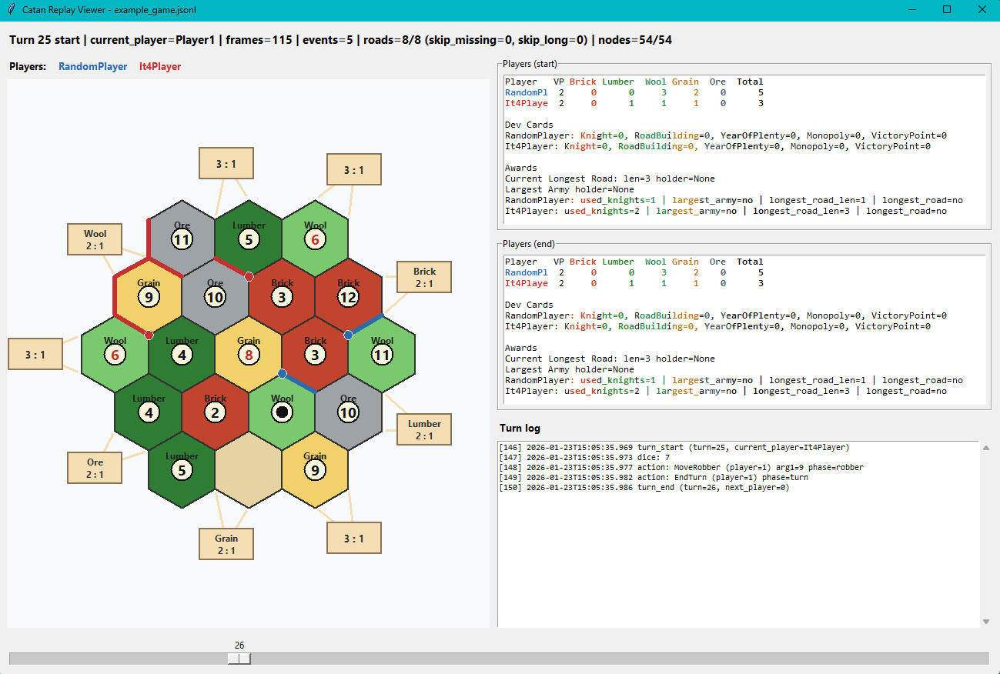

# CatanAPI

[](https://github.com/FerrisOfficial/CatanAPI)
[](https://opensource.org/licenses/MIT)

A powerful Catan (Settlers of Catan) game engine with pre-built AI bots, perfect for game simulations, AI research, and strategy testing. Easy to use, fast to run, and extensible for custom bot development.

## ✨ Features

- **Complete Game Engine**: Full implementation of Catan rules with all game mechanics
- **Multiple AI Bots**: 15+ pre-built bots with different strategies (from simple random to advanced algorithms)
- **High Performance**: Run thousands of games in minutes
- **Game Viewer**: Visualize games with an interactive replay viewer
- **Extensible**: Easy to add new bots and modify game rules
- **Cross-Platform**: Works on Windows, Linux, and macOS
- **Comprehensive Testing**: Full test suite ensuring game correctness

## 🚀 Quick Start

### Prerequisites
- C++17 compatible compiler (GCC, Clang, MSVC)
- CMake 3.10+
- Python 3.6+ (for training tools)

### Installation

```bash
# Clone the repository
git clone https://github.com/yourusername/CatanAPI.git
cd CatanAPI

# Configure and build
cmake -S . -B build -G "MinGW Makefiles"  # or your preferred generator
cmake --build build
```

### Run Your First Game

```bash
# Run a single game between two random bots
build/runs/run.exe rp rp

# Run 1000 games for statistics
build/runs/run.exe -n 1000 --no-dump rp rp
```

## 🤖 Available Bots

| Bot | Strategy | Difficulty | Speed |
|-----|----------|------------|-------|
| `rp` | Random moves | Easy | ⚡ Fast |
| `it1` | Basic iterative | Easy | ⚡ Fast |
| `it2` | Improved placement + robber | Medium | ⚡ Fast |
| `it3` | + Dev card management | Medium | ⚡ Fast |
| `it4` | + Optimized dev playing | Hard | ⚡ Fast |
| `it5` | Full strategy | Hard | ⚡ Fast |
| `ab` | Alpha-beta algorithm | Expert | 🐌 Slow |
| `cr` | City rush focus | Hard | ⚡ Fast |
| `dev` | Development card focus | Hard | ⚡ Fast |
| `or` | One resource monopoly | Medium | ⚡ Fast |
| `para` | Parametric (configurable) | Variable | ⚡ Fast |

## 🎮 Game Viewer

Watch games unfold with the built-in replay viewer:

```bash
python utils/replay_viewer.py logs/game_log.jsonl
```

For more options, run: `python utils/replay_viewer.py --help`



The viewer shows:
- Board state evolution
- Player actions and resources
- Victory point progression
- Interactive controls for navigation

## 📊 Running Simulations

### Basic Usage

```bash
# Compare two bots
build/runs/run.exe it5 rp -n 1000 --no-dump

# Use different bots
build/runs/run.exe ab cr -n 500
```

### Advanced Options

- `-n, --games <N>`: Number of games (default: 1)
- `--no-dump`: Disable logging (faster for large runs)
- `--switch`: Swap player positions halfway through

For a complete list of options, run: `build/runs/run.exe --help`

### Example Output

```
Games played: 1000
BotA wins: 65.2%
BotB wins: 34.8%
Metrics: It5Player, LR%=23.1, LA%=12.4, avgDevCards=5.2, ...
         RandomPlayer, LR%=8.7, LA%=4.1, avgDevCards=2.1, ...
```

## 🛠️ Adding Custom Bots

Create your own AI bot in minutes:

1. Create `myBot.hpp` and `myBot.cpp` in `players/`
2. Inherit from IPlayer and implement required methods
3. Add to CMakeLists.txt
4. Run: `build/runs/run.exe myBot rp`

See players/README.md for detailed guide and examples.

## 🧪 Testing

Run the full test suite:

```bash
cmake --build build
ctest --test-dir build -V
```

## 📈 Performance

- Single game: ~20ms
- 1000 games: ~1 minute
- Scales linearly with game count

## 🤝 Contributing

We welcome contributions! Please:

1. Fork the repository
2. Create a feature branch
3. Add tests for new functionality
4. Ensure all tests pass
5. Submit a pull request

## 📄 License

This project is licensed under the MIT License - see the [LICENSE](LICENSE) file for details.

## 🙏 Acknowledgments

- Based on the classic board game "The Settlers of Catan" by Klaus Teuber
- Inspired by various Catan AI projects in the community
- Built with modern C++ and CMake

---

**Enjoy simulating Catan games!** 🎲🏝️
