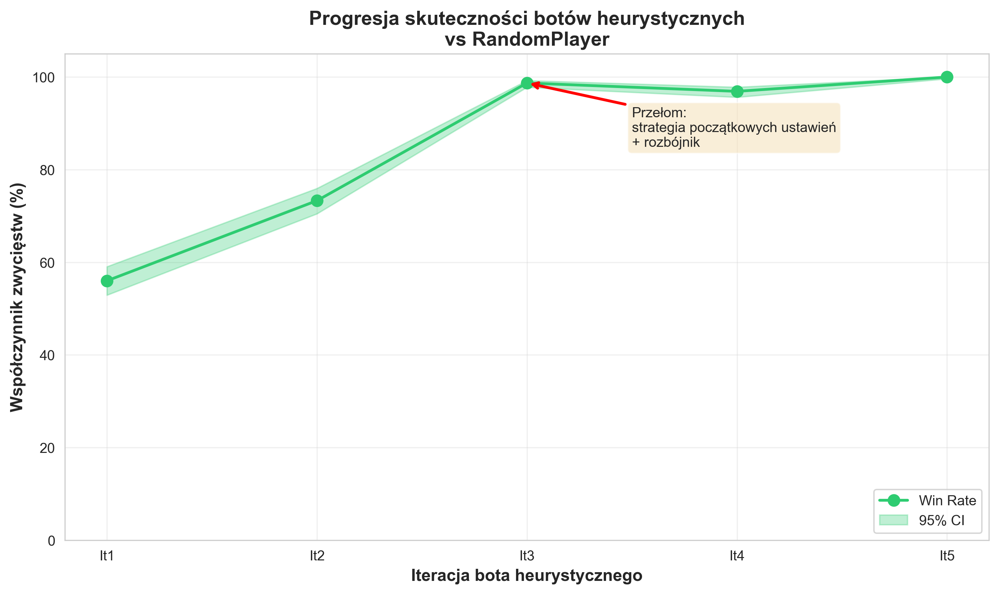
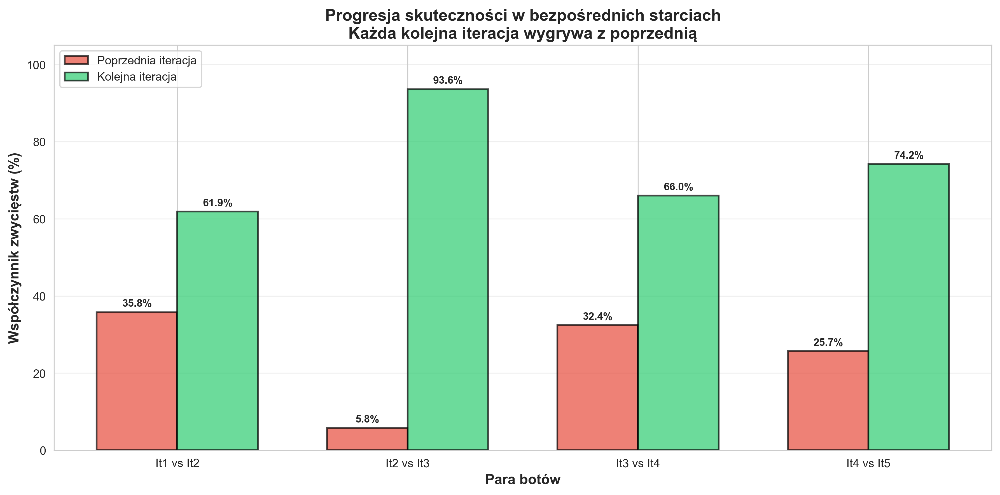
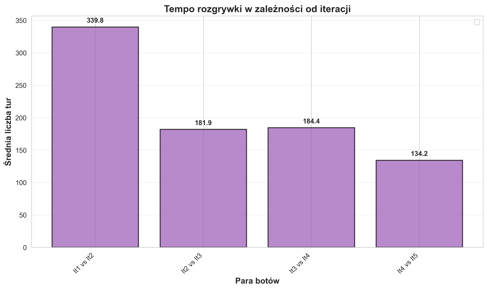

## Streszczenie
Praca składa się z dwóch zasadniczych części. Pierwszym celem pracy jest zaprojektowanie oraz implementacja silnika gry planszowej Catan w wersji dwuosobowej (1 vs 1) w języku C++. Implementacja została wykonana z naciskiem na wydajność oraz elastyczność, w szczególności poprzez efektywną reprezentację stanu gry, system aplikowania i cofania akcji oraz modelowanie obiektów występujących w grze. Poprawność działania silnika została zweryfikowana za pomocą rozbudowanego zestawu testów jednostkowych i integracyjnych.

Drugim celem pracy, o charakterze badawczym, jest implementacja oraz porównanie botów wykorzystujących różne strategie rozgrywki. Przedstawiono kilka typów graczy automatycznych, w tym graczy losowych, heurystycznych oraz gracza wykorzystującego algorytm przeszukiwania drzewa gry. Skuteczność poszczególnych botów została oceniona na podstawie przeprowadzonych eksperymentów i analizy uzyskanych wyników.

Dodatkowo opracowano moduł rejestracji i odtwarzania rozgrywek, umożliwiający szczegółowe prześledzenie przebiegu gry pomiędzy wybranymi botami krok po kroku. Moduł ten wspiera analizę zachowania graczy automatycznych, ułatwia debugowanie silnika gry oraz stanowi narzędzie pomocnicze w procesie porównywania strategii.

## Streszczenie po angielsku

This thesis consists of two main parts. The first goal is to design and implement a two-player (1 vs 1) Catan game engine in C++ with a strong focus on performance, determinism, and testability. The implementation emphasizes an efficient game-state representation, a unified action system, and a reversible state transition mechanism (apply/undo) to enable fast simulation.

The second goal is of an experimental nature: to implement and compare multiple automated players (bots) based on different decision-making strategies (random, heuristic-based, and tree-search approaches). The evaluation is supported by a dedicated gameplay logging and replay module that enables step-by-step inspection of game trajectories and facilitates both debugging and empirical analysis.

## Spis treści
Spis treści jest generowany automatycznie w docelowym formacie publikacji (PDF). W wersji Markdown pozostawiono wyłącznie strukturę nagłówków.
## 1. Wstęp
### 1.1. Wprowadzenie do tematyki gier planszowych i sztucznej inteligencji

Sztuczna inteligencja od wielu lat stanowi istotny obszar badań w kontekście gier, w szczególności gier cyfrowych, gdzie znajduje zastosowanie m.in. w projektowaniu przeciwników sterowanych komputerowo, generowaniu treści oraz personalizacji rozgrywki. W przypadku gier planszowych zakres wykorzystania algorytmów sztucznej inteligencji jest węższy, co wynika z ich analogowej natury oraz fizycznych komponentów, jednak w ostatnich latach obserwuje się dynamiczny wzrost zainteresowania tym obszarem badawczym.

Jednym z podstawowych zastosowań sztucznej inteligencji w grach planszowych jest wsparcie procesu projektowania i testowania mechanik gry. Współczesne gry planszowe, w szczególności tzw. eurogry, charakteryzują się dużą złożonością decyzyjną, licznymi zależnościami pomiędzy elementami gry oraz koniecznością zachowania balansu pomiędzy różnymi strategiami. Tradycyjne testowanie takich gier wymaga znacznych nakładów czasu i pracy ludzkich testerów, co czyni automatyczne symulacje rozgrywek atrakcyjną alternatywą.

Algorytmy sztucznej inteligencji umożliwiają symulowanie tysięcy rozgrywek w krótkim czasie, analizowanie drzew decyzyjnych oraz ocenę skuteczności poszczególnych strategii. Metody te pozwalają na identyfikację niezbalansowanych mechanik, dominujących strategii oraz rzadkich, lecz istotnych scenariuszy rozgrywki, które mogłyby zostać pominięte w testach manualnych. W praktyce prowadzi to do bardziej obiektywnej analizy systemu gry i usprawnia proces iteracyjnego doskonalenia zasad.

### 1.2. Gra Catan – charakterystyka i potencjał badawczy

*Catan* (wcześniej znany jako *The Settlers of Catan*) to strategiczna gra planszowa zaprojektowana przez Klausa Teubera, w której gracze rozwijają osadnictwo na wyspie poprzez pozyskiwanie surowców, handel oraz budowę dróg, osad i miast. Rozgrywka łączy elementy planowania ekonomicznego z umiarkowaną losowością wynikającą z rzutów kośćmi decydujących o produkcji zasobów.

### 1.2.1. Plansza, cel gry i podstawowe zasady

Plansza gry *Catan* składa się z heksagonalnych pól reprezentujących różne typy terenu, takich jak lasy, wzgórza, pola uprawne, pastwiska oraz góry, z których każde odpowiada określonemu rodzajowi surowca. Pola te rozmieszczone są w sposób modularny, co powoduje, że każda rozgrywka posiada inną konfigurację przestrzenną. Pomiędzy heksami znajdują się węzły (skrzyżowania), na których gracze mogą budować osady i miasta, oraz krawędzie, na których budowane są drogi.

Każdy typ pola produkcyjnego na planszy odpowiada określonemu surowcowi:
- lasy produkują drewno (*Lumber*),
- wzgórza produkują cegłę (*Brick*),
- pola uprawne produkują zboże (*Grain*),
- pastwiska produkują wełnę (*Wool*),
- góry produkują rudę (*Ore*).

Każdy heks produkcyjny posiada przypisaną losowo liczbę z zakresu 2–12 (z wyjątkiem 7), która odpowiada możliwym sumom wyrzuconym na dwóch sześciennych kościach. Liczby te determinują, kiedy dany heks produkuje surowce — po rzucie kośćmi wszystkie heksy oznaczone liczbą odpowiadającą wyrzuconej sumie generują zasoby dla graczy posiadających przy nich osady lub miasta [7].


Rysunek: Przykładowa plansza gry.

Pola pustynne nie generują zasobów i stanowią początkową lokalizację rozbójnika.

**Rozbójnik** to specjalna figura, która blokuje produkcję surowców z heksu, na którym się znajduje. Gdy gracz wyrzuci sumę 7 na kościach, musi przemieszczyć rozbójnika na wybrany heks (blokując jego produkcję) i może ukraść jedną kartę zasobów od gracza posiadającego osadę lub miasto przy tym heksie.

Celem gry jest zdobycie **10 punktów zwycięstwa** (15 w wariancie rozgrywki 1 vs 1). Punkty te są przyznawane głównie za budowę osad (1 punkt zwycięstwa) i miast (2 punkty zwycięstwa). 

Osady i miasta muszą być połączone drogami — każda nowa struktura musi być dostępna przez ciągłą sieć dróg gracza. Ponadto obowiązuje **zasada dystansu**: osady i miasta różnych graczy (oraz własne) muszą być oddalone od siebie o co najmniej dwie krawędzie.

Każda struktura ma określony koszt budowy wyrażony w surowcach:
- **Droga**: drewno + cegła (1+1),
- **Osada**: drewno + cegła + wełna + zboże (1+1+1+1),
- **Miasto**: ruda + ruda + ruda + zboże + zboże (3+2) — budowane poprzez modernizację istniejącej osady,
- **Karta rozwoju**: ruda + wełna + zboże (1+1+1).


Rysunek: Koszty budowy struktur przedstawione wizualnie.

**Karty rozwoju** stanowią dodatkowy element strategiczny gry. Po zakupie karty są losowane z talii i mogą być trzech typów: **Rycerz** (umożliwia przemieszczenie rozbójnika i kradzież zasobu od przeciwnika), **Postęp** (karty specjalne takie jak Monopol, Rok Obfitości czy Budowa Dróg) oraz **Punkty zwycięstwa** (ukryte karty dające 1 VP każda, ujawniane dopiero przy osiągnięciu zwycięstwa). Karty Rycerz mogą być zagrywane w dowolnym momencie tury, natomiast karty Postęp i Punkty zwycięstwa są zagrywane przed rzutem kośćmi.

Dodatkowymi źródłami punktów zwycięstwa są premie:
- Premia **Najdłuższa Droga** przyznawana jest graczowi posiadającemu najdłuższy nieprzerwany ciąg połączonych dróg o długości co najmniej pięciu segmentów. Premia ta może zostać odebrana przez innego gracza, jeśli zbuduje on dłuższą drogę.
- Premia **Największa Armia** przyznawana jest graczowi, który jako pierwszy użyje co najmniej trzech kart Rycerz i posiada ich więcej niż pozostali gracze. Podobnie jak w przypadku Najdłuższej Drogi, premia ta jest dynamiczna i może przechodzić pomiędzy graczami w trakcie rozgrywki.

Każda z tych premii zapewnia dodatkowe **2 punkty zwycięstwa**, istotnie wpływając na strategię oraz tempo gry. W dalszej części pracy punkty zwycięstwa będą oznaczane skrótem **VP** (ang. *Victory Points*). Rozgrywka toczy się w turach, a zwycięstwo następuje natychmiast po osiągnięciu wymaganej liczby punktów przez jednego z graczy.

Podstawowy przebieg tury obejmuje rzut dwiema kośćmi sześciennymi, który determinuje produkcję zasobów na planszy. Gracze otrzymują surowce z tych pól, których numer odpowiada wyrzuconej sumie — osada zapewnia 1 zasób z każdego przylegającego heksu, a miasto 2 zasoby. W przypadku gdy została wyrzucona liczba 7, żaden heks nie produkuje; zamiast tego gracze posiadający więcej niż 9 kart zasobów (zgodnie z implementacją wariantu 1 vs 1) muszą odrzucić połowę (zaokrąglając w dół), a aktywny gracz przemieszcza rozbójnika na wybrany heks (blokując jego produkcję) i może ukraść jedną kartę zasobów od gracza posiadającego osadę lub miasto przy tym heksie [7].

Następnie możliwe jest wykonywanie akcji budowy, takich jak wznoszenie dróg, osad, miast lub zakup kart rozwoju. W klasycznej wersji gry występuje również handel (z innymi graczami lub z bankiem). Handlowanie z bankiem odbywa się według standardowego kursu 4:1 (cztery dowolne zasoby za jeden wybrany), jednak gracze posiadający osadę lub miasto przy porcie mogą korzystać z lepszych kursów: port 3:1 (trzy dowolne za jeden) lub port 2:1 (dwa konkretne surowce za jeden tego samego typu).

Istotnym elementem gry jest losowość wynikająca z rzutów kośćmi, która wpływa na tempo pozyskiwania zasobów, jednak decyzje strategiczne — wybór lokalizacji budowy, kierunek rozwoju infrastruktury oraz zarządzanie zasobami — mają kluczowe znaczenie dla długoterminowego sukcesu. Ta kombinacja **niepełnej informacji, losowości i planowania** sprawia, że *Catan* stanowi interesujące środowisko badawcze dla analizy algorytmów decyzyjnych i strategii gry.

### 1.2.2. Produkcja zasobów i miara pipsów

Jak wspomniano wcześniej, każde pole produkcyjne (heks) na planszy posiada przypisaną liczbę z zakresu 2–12 (z wyjątkiem 7). Ze względu na różną liczbę kombinacji prowadzących do danej sumy, poszczególne liczby mają odmienne prawdopodobieństwo wystąpienia. W praktyce wprowadza się miarę **pipsów** (z ang. *pips*, dosłownie: oczka na kości), która odzwierciedla częstość występowania danej liczby:

- **2 lub 12**: 1 pipsa (1 kombinacja: 1+1 lub 6+6),
- **3 lub 11**: 2 pipsy (2 kombinacje: 1+2, 2+1 lub 5+6, 6+5),
- **4 lub 10**: 3 pipsy (3 kombinacje),
- **5 lub 9**: 4 pipsy (4 kombinacje),
- **6 lub 8**: 5 pipsów (5 kombinacji).

Miara pipsów stanowi użyteczne narzędzie analityczne, ponieważ bezpośrednio odzwierciedla **wartość oczekiwaną produkcji** z danego pola. Heksy o wyższych pipsach generują zasoby częściej, co czyni je bardziej wartościowymi celami w fazie ustawień początkowych oraz podczas oceny potencjału produkcyjnego pozycji gracza. Pojęcie to będzie wykorzystywane w dalszej części pracy przy opisie strategii botów, które oceniają jakość lokalizacji budowy oraz prognozują przyszłą produkcję zasobów. W szerszej perspektywie pipsy stanowią również praktyczną miarę ograniczającą wpływ losowości na długoterminowy wynik rozgrywki, co jest często omawiane w analizach relacji „luck vs skill” w Catanie [10].

### 1.2.3. Wariant 1 vs 1 przyjęty w pracy

W niniejszej pracy analizowana jest wersja gry *Catan* w wariancie 1 vs 1. W wariancie tym pominięto handel pomiędzy graczami, ponieważ w rozgrywce dwuosobowej traci on swój negocjacyjny charakter, a często sprowadza się do decyzji trywialnych lub symetrycznych.

Pominięcie handlu między graczami upraszcza część społeczno-negocjacyjną gry, jednocześnie zwiększając kontrolę eksperymentalną — umożliwia prowadzenie powtarzalnych symulacji, jednoznaczne porównywanie botów oraz przypisywanie obserwowanych różnic w wynikach konkretnym strategiom decyzyjnym. Jednocześnie w wariancie 1 vs 1 zachowane zostają kluczowe własności istotne z punktu widzenia badań nad algorytmami decyzyjnymi, takie jak zarządzanie zasobami, decyzje przestrzenne na planszy, losowość wynikająca z rzutów kośćmi oraz bezpośrednia rywalizacja o punkty zwycięstwa i osiągnięcia specjalne.

### 1.2.4. Zalety gry *Catan*

Jedną z najczęściej wskazywanych zalet gry Catan jest umiejętne połączenie relatywnie prostych zasad z wysokim poziomem satysfakcji oraz głębią strategiczną. W recenzji opublikowanej na łamach magazynu Pyramid podkreślono, że gra oferuje satysfakcjonujące doświadczenie rozwoju ekonomicznego i wymiany zasobów, przy jednocześnie umiarkowanym czasie rozgrywki, wynoszącym zazwyczaj od półtorej do dwóch godzin. Zwrócono uwagę, że poziom satysfakcji płynący z rozgrywki jest porównywalny z grami o znacznie dłuższym czasie trwania.

Drugim, bardzo istotnym atutem jest wysoka regrywalność: plansza składa się z heksów, a ich układ i przypisane numery produkcji można zmieniać między partiami, co ogranicza powtarzalność i utrudnia wyuczenie jednej „sztywnej” sekwencji optymalnych ruchów. Dzięki temu gra sprzyja analizie adaptacyjnych strategii oraz reagowania na bieżącą sytuację na planszy.

*Catan* jest uznanym tytułem o silnym wpływie kulturowym i branżowym: zdobył prestiżowe nagrody (m.in. Spiel des Jahres w 1995 oraz Game of the Century według Gamescom w 2015) i stał się jednym z symboli „nowoczesnych” gier planszowych [9].

#### Scena turniejowa i mistrzostwa

Istotnym potwierdzeniem dojrzałości gry jako dyscypliny rywalizacyjnej jest rozbudowana scena turniejowa. Oficjalna strona CATAN opisuje system mistrzostw obejmujący turnieje krajowe oraz wydarzenia międzynarodowe, takie jak mistrzostwa świata, Europy czy obu Ameryk [8].

Równolegle funkcjonuje program „CATAN Championship” organizowany w wielu krajach: gracze rywalizują w turniejach kwalifikacyjnych i narodowych, a zwycięzcy uzyskują możliwość udziału w wydarzeniach najwyższej rangi. Opis tej struktury (rundy wstępne, przejście do fazy pucharowej, awans do finałów narodowych) pokazuje, że *Catan* posiada standaryzowane ramy rywalizacji, co jest korzystne także z perspektywy projektowania eksperymentów porównawczych z udziałem botów.

#### Potencjał badawczy (w kontekście botów)

Z perspektywy badań nad algorytmami decyzyjnymi *Catan* jest szczególnie interesujący, ponieważ łączy kilka źródeł złożoności:

* **losowość** (dystrybucja zasobów zależna od rzutów),
* **wieloetapowe decyzje sekwencyjne** (budowa, handel, rozwój),
* **interakcję strategiczną** (blokady, wyścig o przestrzeń i punkty),
* **wiele dróg do zwycięstwa** (różne kombinacje budowy, kart rozwoju i premii).

Połączenie tych elementów sprawia, że *Catan* stanowi wartościowe środowisko do testowania i porównywania różnych strategii algorytmów decyzyjnych.

### 1.3. Cel i zakres pracy

Celem aplikacyjnym pracy jest zaprojektowanie i implementacja silnika gry *Catan* w wariancie 1 vs 1 w języku C++, przeznaczonego do wykonywania dużej liczby symulacji oraz do integracji z automatycznymi graczami. Osiągnięcie tego celu wymagało w szczególności opracowania spójnej reprezentacji stanu gry, jednoznacznego systemu akcji oraz mechanizmu deterministycznego wykonywania i cofania ruchów.

Celem badawczym pracy jest zaprojektowanie, implementacja oraz porównanie botów wykorzystujących różne strategie decyzyjne, obejmujące podejścia losowe, heurystyczne oraz przeszukujące. Porównanie przeprowadzono w oparciu o metryki opisujące wyniki i przebieg rozgrywek (m.in. odsetek zwycięstw oraz statystyki zależne od długości gry).

Zakres pracy obejmuje:
- implementację silnika symulacyjnego dla wariantu 1 vs 1 wraz z walidacją reguł,
- implementację zestawu botów oraz wspólnego interfejsu gracza,
- przygotowanie narzędzi do rejestracji i odtwarzania rozgrywek (replay),
- przeprowadzenie eksperymentów porównawczych i analizę wyników.

### 1.4. Struktura pracy

Rozdział 2 przedstawia przegląd istniejących rozwiązań i prac naukowych związanych z symulacją gry *Catan* oraz projektowaniem botów. Rozdział 3 definiuje założenia wariantu 1 vs 1 oraz wymagania projektowe silnika. W rozdziale 4 opisano architekturę i szczegóły implementacji (model stanu, system akcji, mechanizm cofania oraz narzędzia diagnostyczne). Rozdziały 5–8 prezentują sposób uruchamiania symulacji, eksperymenty porównawcze, wyniki oraz ich analizę. Rozdział 9 zawiera podsumowanie oraz wnioski.

## 2. Przegląd istniejących rozwiązań

### 2.1. Istniejące implementacje Catana

Gra *Settlers of Catan* od wielu lat stanowi obiekt zainteresowania zarówno hobbystycznych projektów programistycznych, jak i badań naukowych nad sztuczną inteligencją w grach planszowych. W związku z tym powstało kilka implementacji silników gry oraz środowisk symulacyjnych, które umożliwiają eksperymentowanie z automatycznymi graczami.

#### Catanatron

*Catanatron* jest jednym z najbardziej zaawansowanych otwartych środowisk symulacyjnych dla gry *Settlers of Catan*. Projekt został zaprojektowany z myślą o masowym uruchamianiu symulacji oraz testowaniu algorytmów decyzyjnych, w szczególności metod opartych na uczeniu przez wzmacnianie. Architektura systemu umożliwia łatwą integrację własnych agentów poprzez zunifikowany interfejs gracza. Dodatkowo środowisko udostępnia wrapper kompatybilny z OpenAI Gym, co pozwala na wykorzystanie istniejących bibliotek RL.  
Źródło: dokumentacja projektu Catanatron [1].

#### JSettlers

*JSettlers* to starszy, lecz istotny projekt implementujący grę Catan w języku Java. System zawiera zarówno silnik gry, jak i proste boty regułowe. Projekt ten był wielokrotnie wykorzystywany jako punkt wyjścia w pracach badawczych i dydaktycznych, szczególnie w kontekście gier wieloagentowych.  
Źródło: oficjalna strona projektu [2].

#### CatanAI i projekty eksperymentalne

Istnieją również projekty badawcze i studenckie, takie jak *CatanAI*, implementujące grę w Pythonie wraz z agentami opartymi o heurystyki, Reinforcement Learning lub Monte Carlo Tree Search. Projekty te często nie są zoptymalizowane wydajnościowo, lecz służą jako środowiska eksperymentalne do testowania algorytmów.  
Źródło: repozytorium GitHub CatanAI [3].

#### Tabela porównawcza istniejących rozwiązań

| Projekt / Praca | Język | Typ | Obsługa botów | Zastosowanie |
|-----------------|-------|-----|---------------|-------------|
| Catanatron | Python | Symulator | RL, heurystyki | Badania, benchmarki |
| JSettlers | Java | Silnik gry | Regułowe | Edukacja |
| CatanAI | Python | Framework AI | RL, MCTS | Eksperymenty |
| Szita et al. (2009) | — | Publikacja | MCTS | Badania naukowe |
| Burre et al. (2020) | — | Publikacja | Deep RL | Badania naukowe |

### 2.2. Boty i algorytmy decyzyjne w grach planszowych

Projektowanie botów do gier planszowych stanowi klasyczny problem w dziedzinie sztucznej inteligencji. W zależności od złożoności gry oraz dostępnej informacji stosuje się różne podejścia decyzyjne.

#### Monte Carlo Tree Search
Monte Carlo Tree Search (MCTS) jest algorytmem przeszukiwania drzewa gry opartym na losowych symulacjach. Algorytm ten odniósł znaczący sukces w grach o dużej przestrzeni stanów, takich jak Go. Jego zastosowanie w grach z losowością i wieloma graczami, w tym w *Settlers of Catan*, zostało opisane w literaturze naukowej.

Szita, Chaslot i Spronck zaprezentowali jedną z pierwszych analiz zastosowania MCTS w Catanie, wskazując na możliwość adaptacji algorytmu do środowisk z niepełną informacją i elementami losowymi [4].

#### Uczenie przez wzmacnianie

Uczenie przez wzmacnianie (Reinforcement Learning) umożliwia agentom nabywanie strategii poprzez interakcję z otoczeniem i maksymalizację funkcji nagrody. W kontekście Catana badano zarówno klasyczne metody RL, jak i ich połączenie z MCTS.

W pracy Burre i in. przedstawiono zastosowanie algorytmów Deep Q-Learning w środowisku Catana, analizując skuteczność agentów uczonych przez symulacje [5]. Inne badania skupiają się na problemie negocjacji i handlu pomiędzy agentami, co stanowi istotny element rozgrywki w Catanie [6].

#### Heurystyki i podejścia regułowe

Alternatywą dla metod uczących się są boty oparte na heurystykach eksperckich. Strategie te wykorzystują wiedzę domenową, taką jak wartości pól, prawdopodobieństwa rzutów kośćmi czy priorytety budowy. Heurystyki te są często stosowane jako punkty odniesienia (baseline) w eksperymentach porównawczych.

### 2.3. Podsumowanie i uzasadnienie autorskiego podejścia

Przegląd istniejących rozwiązań wskazuje, że dominujące implementacje środowisk dla *Catana* (oraz gier o podobnym charakterze) można w uproszczeniu podzielić na dwie grupy. Pierwsza z nich koncentruje się na kompletności funkcjonalnej i ergonomii (często w językach wysokiego poziomu), co sprzyja szybkiemu prototypowaniu, lecz utrudnia uruchamianie dużej liczby symulacji w krótkim czasie. Druga grupa skupia się na wydajności i możliwości integracji z algorytmami decyzyjnymi, jednak często odbywa się to kosztem przejrzystości stanu, jednoznaczności reguł lub możliwości wygodnej diagnostyki przebiegu gry.

W niniejszej pracy przyjęto autorskie podejście łączące oba cele: (1) budowę możliwie wydajnego i testowalnego silnika gry w wariancie 1 vs 1 oraz (2) stworzenie infrastruktury eksperymentalnej do porównywania botów o różnych strategiach, wraz z narzędziami umożliwiającymi weryfikację i analizę rozgrywek.

Podstawowym uzasadnieniem przyjętych decyzji projektowych jest charakter zadania badawczego. Porównywanie botów wymaga uruchamiania tysięcy gier, a w konsekwencji powtarzalnego:
- generowania akcji legalnych w danym stanie,
- wykonywania akcji zgodnie z regułami,
- oceny stanu (funkcje heurystyczne),
- oraz (dla podejść przeszukujących) intensywnego symulowania stanów pośrednich.

Z tego powodu kluczowe stały się wymagania niefunkcjonalne: szybkość symulacji, deterministyczność operacji na stanie oraz możliwość ścisłej walidacji poprawności reguł.

#### Uzasadnienie wyborów projektowych

**Wariant 1 vs 1 jako kompromis badawczy.** W pracy zastosowano wariant rozgrywki dwuosobowej, w którym pominięto handel pomiędzy graczami, pozostawiając handel z bankiem oraz mechanikę portów. Uzasadnieniem jest zwiększenie kontroli eksperymentalnej: eliminacja negocjacji ogranicza elementy trudne do jednoznacznego modelowania i powtórzenia w symulacjach, a jednocześnie zachowuje kluczowe mechaniki decyzyjne: zarządzanie zasobami, decyzje przestrzenne (drogi/osady/miasta), losowość wynikającą z rzutów kośćmi oraz interakcję poprzez rozbójnika i rywalizację o premie.

**Pakowana reprezentacja stanu gry.** Rdzeń systemu stanowi struktura `Board::BoardState`, która przechowuje kompletny stan rozgrywki (heksy, węzły, krawędzie, bank oraz gracze). Zastosowano pakowanie informacji w typach liczbowych (`uint16_t`, `uint32_t`, `uint64_t`) m.in. dla:
- heksów (liczba, zasób, liczniki produkcji dla obu graczy),
- węzłów (typ budowli, właściciel, sąsiedztwo heksów i krawędzi, port),
- krawędzi (droga, właściciel, węzły końcowe),
- stanu gracza i banku (zasoby, karty rozwoju, flagi najdłuższej drogi/największej armii, dostępne budowle).

Takie podejście ma dwa bezpośrednie uzasadnienia. Po pierwsze, redukuje narzut pamięci i poprawia lokalność danych, co jest istotne przy masowym uruchamianiu symulacji. Po drugie, umożliwia bardzo szybkie kopiowanie stanu — co wprost wspiera boty wykorzystujące symulacje na kopiach `BoardState` (np. w przeszukiwaniu alfa-beta).

**Jednolita, pakowana reprezentacja akcji.** Każda decyzja w grze jest modelowana jako `Action::PackedAction` (64-bit), zawierająca typ akcji, identyfikator gracza, argumenty oraz (w razie potrzeby) wektor zasobów. Ujednolicenie formatu akcji pozwala traktować akcję jako „dane” i budować wokół niej:
- jeden interfejs decyzyjny botów,
- wspólny mechanizm wykonania i cofania,
- oraz spójny zapis do logów.

W praktyce jest to realizacja idei wzorca *Command*: boty generują opis operacji, natomiast wykonanie (i walidacja) jest skupione w silniku [13].

**Mechanizm `apply/undo` jako fundament testowalności i AI.** `Board::BoardState` udostępnia metody `applyAction()` oraz `undoLastAction()` i utrzymuje własną kolejkę `actionQueue`, co umożliwia cofanie zmian stanu. W warstwie testów wykorzystano to do weryfikacji, że dla reprezentatywnego zbioru akcji wykonanie i cofnięcie przywraca stan do wartości wyjściowej. Z perspektywy botów mechanizm ten jest również kluczowy, ponieważ pozwala realizować „symulację w przód” i analizę konsekwencji decyzji.

**Generowanie akcji legalnych w jednym miejscu.** Silnik udostępnia zestaw funkcji generujących akcje możliwe w danym stanie (np. budowa drogi/osady/miasta, handel z bankiem, zakup i zagrywanie kart rozwoju, akcje fazy początkowej). Dzięki temu boty nie implementują reguł gry w swoich klasach (co prowadziłoby do powielania logiki i ryzyka rozbieżności), lecz wybierają spośród akcji wygenerowanych przez silnik. Jest to uzasadnione zarówno testowalnością (reguły w jednym miejscu), jak i poprawnością eksperymentów (każdy bot działa w tym samym zbiorze dopuszczalnych decyzji).

**Rozdzielenie silnika i strategii graczy przez interfejs `IPlayer`.** Boty implementują spójny interfejs decyzji dla poszczególnych etapów tury (`getInitialPlacement()`, `get2InitialPlacement()`, `getDevAction()`, `getDiscardAction()`, `getMoveRobber()`, `getTurnAction()`). Pozwala to:
- porównywać strategie przy identycznym „kontrakcie” wejścia/wyjścia,
- wymieniać boty bez zmian w silniku,
- uruchamiać eksperymenty z użyciem jednego programu uruchomieniowego.

Istotnym elementem bezpieczeństwa architektury jest dodatkowa weryfikacja w `Game`: wywołania metod botów są „guardowane” przez porównanie kopii stanu sprzed i po wywołaniu. Dzięki temu bot nie może modyfikować stanu gry bezpośrednio, a jedyną drogą zmiany stanu jest przekazanie akcji do silnika. Chroni to przed trudnymi do wykrycia błędami i zwiększa wiarygodność eksperymentów.

**Dobór botów i iteracyjny rozwój heurystyk.** W projekcie zaimplementowano kilka klas botów, które pełnią rolę punktów odniesienia i kolejnych ulepszeń:
- bot losowy (`RandomPlayer`) jako baseline,
- boty heurystyczne rozwijane iteracyjnie (`It1`–`It5`),
- boty specjalizowane (np. ukierunkowane na karty rozwoju lub drogi),
- bot przeszukujący (`alphaBetaPlayer`), wykorzystujący symulację na kopiach stanu oraz alfa-beta pruning.

Takie spektrum botów uzasadnia się potrzebą uzyskania zarówno prostych punktów odniesienia, jak i bardziej zaawansowanych strategii, które wykorzystują strukturę problemu. W szczególności `alphaBetaPlayer` pokazuje, że zaproponowany model stanu i akcji jest wystarczająco wydajny, aby umożliwiać przeszukiwanie drzewa decyzji w rozsądnych limitach (ograniczanie gałęziowania poprzez filtrowanie akcji deterministycznych oraz ograniczanie liczby kandydatów).

**Parametryzacja heurystyk i trening.** W celu oddzielenia „pomysłu na ocenę” od doboru konkretnych wag, zaimplementowano gracza parametryzowanego (`ParaPlayer`), który wczytuje współczynniki z pliku konfiguracyjnego. Umożliwia to automatyzację strojenia (np. poprzez skrypt uruchamiający serie gier i selekcję parametrów na podstawie win-rate), a także ułatwia raportowanie eksperymentów: zmiana strategii może być opisana zmianą konfiguracji, bez modyfikacji kodu źródłowego.

**Diagnostyka: rejestracja i odtwarzanie rozgrywek.** Dla potrzeb analizy oraz debugowania opracowano moduł `Dumper`, zapisujący przebieg gry do formatu JSONL (stan początkowy, rzuty kośćmi, zastosowane akcje, stany na początku i końcu tury). Uzupełnieniem jest narzędzie `utils/replay_viewer.py`, które potrafi odtworzyć i zwizualizować rozgrywkę na podstawie logu. Uzasadnieniem tego elementu jest praktyczna obserwacja, że w projektach łączących złożoną logikę reguł i boty decyzyjne sama poprawność testów nie wystarcza — konieczne są narzędzia pozwalające prześledzić przebieg rozgrywki i szybko zidentyfikować, czy błąd wynika z silnika, czy z polityki decyzyjnej.

**Walidacja poprawności poprzez testy.** Silnik został objęty zestawem testów jednostkowych i integracyjnych opartych o GoogleTest. Szczególną rolę pełnią testy weryfikujące poprawność generowania akcji oraz mechanizmu cofania (`undoLastAction`) dla różnych typów akcji. Jest to bezpośrednio uzasadnione tym, że nawet subtelne błędy reguł mogłyby przekładać się na błędne wnioski w części porównawczej botów.

#### Podsumowanie

Autorskie podejście w pracy można streścić jako budowę środowiska symulacyjnego, które świadomie faworyzuje cechy istotne dla badań porównawczych botów: wydajność, deterministyczność operacji na stanie, jedno źródło prawdy dla reguł (generator akcji legalnych + wykonanie akcji), a także silną testowalność i możliwość diagnostyki przebiegu gry (logi JSONL i odtwarzacz). W rezultacie otrzymano spójny system, w którym silnik jest niezależny od strategii, a strategie mogą być rozwijane (heurystycznie, parametrycznie i przeszukująco) bez naruszania poprawności i spójności reguł gry.

## 3. Analiza problemu i założenia projektowe
### 3.1. Wymagania funkcjonalne gry

Celem implementacji jest zapewnienie kompletnego, spójnego przebiegu rozgrywki w wariancie *Catan* 1 vs 1, tak aby stan gry mógł być wykorzystywany zarówno do pojedynczych uruchomień (debugowanie i demonstracje), jak i do masowych eksperymentów porównujących boty. Wymagania funkcjonalne wynikają z konieczności odwzorowania kluczowych mechanik gry oraz z potrzeby udostępnienia jednoznacznych punktów decyzyjnych dla graczy automatycznych.

W ramach niniejszej pracy system powinien realizować następujące funkcje:

1. **Inicjalizacja i generowanie planszy**
    - wygenerowanie losowej konfiguracji planszy przed rozpoczęciem gry (rozmieszczenie typów zasobów i numerów produkcji),
    - ustawienie początkowej pozycji rozbójnika,
    - zainicjalizowanie stanu banku i talii kart rozwoju.

2. **Obsługa fazy początkowej (initial placement)**
    - realizacja standardowej kolejności „węża” dla dwóch graczy: Player0, Player1, Player1, Player0,
    - umożliwienie każdemu graczowi wyboru osady i drogi w ramach dozwolonych lokalizacji,
    - przyznanie zasobów startowych wynikających z drugiej osady (zgodnie z implementacją).

3. **Obsługa pełnego cyklu tury**
    - obsługa zagrywania kart rozwoju w dedykowanej fazie (przed i po rzucie kośćmi),
    - wykonanie rzutu dwiema kośćmi i produkcja zasobów zgodnie z numerami na heksach,
    - obsługa przypadku wyrzucenia 7: odrzucanie zasobów oraz faza rozbójnika,
    - umożliwienie wykonywania akcji w turze aż do zakończenia tury przez akcję kończącą.

4. **Realizacja katalogu akcji zgodnych z zasadami**
    - budowa dróg, osad i miast przy zachowaniu ograniczeń (m.in. zasada dystansu, wymaganie połączenia drogą),
    - handel z bankiem w kursie 4:1 oraz obsługa portów 3:1 i 2:1,
    - zakup kart rozwoju i zagrywanie kart typu: Rycerz (wraz z ruchem rozbójnika), Budowa Dróg, Rok Obfitości, Monopol,
    - utrzymywanie i aktualizacja premii (najdłuższa droga / największa armia) oraz ich wpływ na wynik.

5. **Warunek zakończenia gry i raportowanie wyniku**
    - zakończenie rozgrywki po osiągnięciu progu punktów zwycięstwa w wariancie 1 vs 1 (w implementacji: 15 VP po uwzględnieniu premii),
    - limit maksymalnej liczby tur jako zabezpieczenie przed nieskończoną rozgrywką,
    - możliwość wielokrotnego uruchamiania gier (batch) z raportowaniem statystyk.

6. **Interfejs dla botów i narzędzia wspierające eksperymenty**
    - spójny interfejs `IPlayer` pozwalający botom podejmować decyzje w punktach decyzyjnych silnika,
    - rejestrowanie przebiegu gry do logów (format JSONL) oraz możliwość odtwarzania gry w narzędziu wizualizacyjnym.

### 3.2. Wymagania niefunkcjonalne (wydajność, testowalność)

W części badawczej pracy kluczowe jest uruchamianie dużej liczby symulacji, a także (dla bardziej zaawansowanych botów) intensywne symulowanie stanów pośrednich w trakcie pojedynczej tury. Stąd wynikają następujące wymagania niefunkcjonalne.

**Wydajność symulacji.**
- stan gry powinien być reprezentowany w sposób zwarty, sprzyjający lokalności danych i szybkiemu kopiowaniu,
- operacje wykonywania ruchu oraz generowania akcji legalnych muszą być wystarczająco szybkie, aby umożliwiać eksperymenty na tysiącach gier,
- losowość powinna być generowana niskokosztowo, a zarazem umożliwiać izolowanie symulacji pomocniczych (np. w przeszukiwaniu) od losowości „właściwej” gry.

**Deterministyczność i odtwarzalność.**
- dla ustalonego stanu wejściowego i konkretnej akcji wynik zastosowania akcji powinien być jednoznaczny,
- mechanizm cofania powinien deterministycznie przywracać stan do wartości sprzed zastosowania akcji,
- logi powinny zawierać informacje umożliwiające analizę przebiegu gry krok po kroku.

**Testowalność i weryfikacja poprawności reguł.**
- logika reguł powinna być możliwa do testowania w izolacji od botów,
- kluczowe mechanizmy (w szczególności `applyAction()` / `undoLastAction()` oraz generowanie akcji) muszą być pokryte testami regresyjnymi,
- błędy powinny być możliwie szybko lokalizowane; stąd istotna jest diagnostyka (logi, odtwarzacz) oraz mechanizmy ochronne.

**Separacja odpowiedzialności i bezpieczeństwo interfejsu botów.**
- boty nie mogą modyfikować stanu gry bezpośrednio — jedynym sposobem zmiany stanu jest wykonanie akcji przez silnik,
- system powinien wykrywać próby naruszenia tej zasady w trakcie działania (np. poprzez porównanie stanu przed i po wywołaniu metody bota).

Powyższe wymagania uzasadniają kluczową zasadę projektową przyjętą w pracy: **jedno źródło prawdy dla reguł** — boty operują wyłącznie na stanie i zbiorze akcji wygenerowanych przez silnik, a interpretacja i wykonanie akcji odbywa się centralnie w jednej implementacji.

### 3.3. Ograniczenia wersji 1 vs 1

Wariant 1 vs 1 zastosowany w pracy jest świadomie uproszczony w tych miejscach, które utrudniają powtarzalne eksperymenty lub wprowadzają elementy negocjacyjne trudne do sensownego modelowania dla botów.

Najważniejsze ograniczenia i konsekwencje wariantu:

1. **Brak handlu pomiędzy graczami.** Zachowano handel z bankiem oraz mechanikę portów (4:1, 3:1, 2:1), co nadal wymusza planowanie ekonomiczne, ale eliminuje negocjacje.

2. **Zmodyfikowany próg zwycięstwa.** Rozgrywka kończy się po osiągnięciu 15 punktów zwycięstwa (VP) w wariancie 1 vs 1. W implementacji wynik uwzględnia premie za najdłuższą drogę i największą armię.

3. **Ograniczenia czasowe rozgrywki.** Wprowadzono górny limit liczby tur jako zabezpieczenie przed bardzo długimi lub „zakleszczonymi” grami w eksperymentach masowych.

4. **Reguły rozbójnika i odrzucania zasobów — dopasowanie do implementacji.** W przypadku wyrzucenia 7 aktywowana jest faza odrzucania zasobów oraz faza rozbójnika. W implementacji próg odrzucania wynosi „ponad 9” kart zasobów, a liczba odrzucanych kart to połowa posiadanych (zaokrąglona w dół). Ograniczenie to stabilizuje symulacje w wariancie 1 vs 1 i jest spójne z logiką silnika.

5. **Ograniczenie niepełnej informacji.** System modeluje stan w sposób w pełni obserwowalny dla botów (dostęp do całego `BoardState`). Jest to uzasadnione celem pracy (porównanie strategii w kontrolowanych warunkach) i upraszcza implementację.

### 3.4. Model stanu gry i akcji

Model domenowy zaprojektowano tak, aby stan gry był możliwie zwarty oraz aby operacje na nim były jednoznaczne i testowalne. Rdzeń stanowi struktura `Board::BoardState`, a wszystkie decyzje i zdarzenia w grze są kodowane jako `Action::PackedAction`.

#### Stan gry

`Board::BoardState` zawiera m.in.:
- pozycję rozbójnika (`robberPosition`),
- tablice heksów, węzłów i krawędzi o stałym rozmiarze (topologia planszy jest stała, a zmienia się jedynie ich zawartość),
- pakowany stan dwóch graczy (`packedPlayers`) oraz banku (`packedBank`),
- informacje sterujące przebiegiem gry (`currentPlayer`, `currentTurn`),
- historię zastosowanych akcji (`actionQueue`) wykorzystywaną do cofania.

Szczególnie istotna jest decyzja, aby heksy przechowywały nie tylko typ zasobu i numer, lecz także zakodowaną informację o „udziale w produkcji” dla obu graczy. Dzięki temu produkcja po rzucie kośćmi może być realizowana bez analizowania sąsiedztwa węzłów w każdej turze.

#### Akcja jako nośnik decyzji

Akcja jest kodowana jako 64-bitowa wartość zawierająca:
- typ akcji (np. budowa, handel, rzut kośćmi, koniec tury),
- identyfikator gracza wykonującego akcję,
- argumenty liczbowe (np. identyfikator krawędzi/węzła/heksu, typ zasobu, kurs portu),
- opcjonalny wektor zasobów (np. w odrzucaniu zasobów).

Jednolity format akcji ma kluczowe znaczenie dla spójności systemu: boty zwracają akcje, silnik je interpretuje, a ten sam zapis może zostać wykorzystany do logowania i odtwarzania.

#### „Jedno źródło prawdy” dla reguł

W systemie przyjęto zasadę, że **reguły gry są implementowane wyłącznie w silniku**, a boty nie powielają logiki walidacji. Z technicznego punktu widzenia składają się na to dwa elementy:

1. **Generowanie akcji legalnych** dla danego stanu i gracza (np. `getLegalActions()` oraz wyspecjalizowane generatory dla budowy, handlu, kart rozwoju i faz początkowych).
2. **Wykonanie akcji** w jednym miejscu (`applyAction()`), które aktualizuje stan zgodnie z regułami oraz zapisuje informację do historii cofania.

W konsekwencji bot działa w modelu: *obserwuj stan → wybierz akcję z listy legalnych → przekaż do silnika*. Takie podejście minimalizuje ryzyko rozbieżności pomiędzy botami oraz zapewnia porównywalność wyników.

#### Cofanie akcji i symulacje stanów pośrednich

Mechanizm `undoLastAction()` umożliwia deterministyczne cofanie zmian po zastosowaniu akcji. Jest to istotne zarówno w testach, jak i w botach wykorzystujących symulacje (np. przeszukiwanie alfa-beta), gdzie wielokrotnie analizuje się konsekwencje różnych decyzji na kopiach stanu. W testach regresyjnych weryfikuje się m.in. własność: zastosowanie akcji i jej cofnięcie przywraca stan do wartości początkowej.

Rozdział 4 przedstawia szczegóły implementacyjne powyższych założeń, ze szczególnym uwzględnieniem pakowanej reprezentacji danych, generatorów akcji oraz mechanizmów wspierających diagnostykę i eksperymenty.


## 4. Architektura i implementacja systemu

### 4.1. Wybór technologii i narzędzi

Rozdział 3 opisuje uzasadnienie przyjętych decyzji projektowych. Poniżej przedstawiono technologie i narzędzia w takim zakresie, w jakim są one widoczne w implementacji i procesie budowania projektu.

Projekt jest rozwijany w języku **C++17** (ustawienie standardu w pliku konfiguracyjnym CMake). Całość budowana jest z użyciem **CMake**, a zależność do frameworku testowego jest pobierana i konfigurowana automatycznie przez mechanizm `FetchContent`.

Testy zostały zaimplementowane w oparciu o **GoogleTest/GMock** (pobierane jako `v1.14.0`) i uruchamiane przez CTest (`gtest_discover_tests`). Dzięki temu testy są wykrywane automatycznie po kompilacji, a pipeline testowy jest spójny niezależnie od platformy.

W projekcie dostępna jest opcjonalna konfiguracja diagnostyczna `ENABLE_ASAN`, która dodaje flagi AddressSanitizer przy kompilatorach GNU/Clang, co ułatwia wykrywanie błędów pamięci w trakcie rozwoju.

Do analizy przebiegu rozgrywek wykorzystywany jest zapis zdarzeń w formacie **JSONL** (logger w C++), a do odtwarzania i wizualizacji logów przygotowano narzędzie w **Python** (interfejs Tkinter). Pozwala to odseparować lekki, wydajny runtime symulacji od narzędzi analitycznych.


### 4.2. Struktura projektu

Struktura repozytorium bezpośrednio odzwierciedla podział na silnik symulacji, implementacje botów, moduł uruchomieniowy oraz testy:

- katalog `game_simulation/` zawiera implementację rdzenia gry: stan planszy i jego modyfikacje (`board.*`), generator akcji (`board_generate_actions.cpp`) oraz logikę przebiegu rozgrywki (`game.*`),
- katalog `players/` zawiera wspólny interfejs gracza (`player.hpp`) i konkretne strategie botów (m.in. losowy, iteracyjne heurystyki, alpha-beta, gracze wyspecjalizowani),
- katalog `runs/` zawiera program uruchomieniowy (`run.cpp`) do odpalania symulacji z linii poleceń,
- katalog `utils/` zawiera narzędzia pomocnicze (m.in. logger rozgrywek w JSONL i narzędzia analityczne),
- katalog `tests/` zawiera testy jednostkowe i integracyjne uruchamiane przez CTest.

Z perspektywy systemu budowania istotne są trzy elementy:

- biblioteka `game_simulation`, która kompiluje rdzeń gry, wybrane boty i logger (współdzielony kod dla testów oraz programu uruchomieniowego),
- program `run` (w `runs/`), linkowany z `game_simulation` i rozszerzony o dodatkowe implementacje botów, które mają być dostępne w trybie uruchomieniowym,
- zestaw binarek testowych (w `tests/`), linkowanych z `gtest_main`, `gmock` oraz `game_simulation`.

Logika sterująca przebiegiem gry (fazy, kolejność wywołań API botów) jest zaimplementowana w `Game` (`game_simulation/game.*`), natomiast modyfikacje stanu są skupione w `Board::BoardState` (`game_simulation/board.*`). Decyzje botów są przekazywane do silnika wyłącznie jako wartości typu `Action::PackedAction`.


### 4.3. Implementacja planszy i elementów gry

Wariant planszy gry jest modelowany jako graf o stałej topologii, jednak w implementacji nie występują dynamiczne struktury grafowe. Zamiast tego zastosowano tablice o rozmiarach zdefiniowanych w pliku stałych (`consts.hpp`), a powiązania są przechowywane bezpośrednio w pakowanych rekordach elementów planszy.

Stan planszy jest częścią struktury `Board::BoardState` (`game_simulation/board.hpp`) i składa się z trzech tablic:

- `hexes[HEX_COUNT]` (heksy) typu `Board::Hex::PackedHex` (`uint16_t`),
- `nodes[NODE_COUNT]` (węzły) typu `Board::Node::PackedNode` (`uint64_t`),
- `edges[EDGE_COUNT]` (krawędzie) typu `Board::Edge::PackedEdge` (`uint32_t`).

Pakowanie pól zostało opisane jawnie w komentarzach w pliku nagłówkowym i jest realizowane przez zestaw funkcji `pack*`/`unpack*`.

Heks (`PackedHex`) koduje:

- numer Catana w bitach 0–3,
- typ zasobu w bitach 4–6,
- wartości produkcji przypisane do graczy w bitach 7–12 (po 3 bity na gracza).

Wartości produkcji w heksie nie są „wynikiem rzutu”, lecz licznikami mówiącymi, ile osad/miast danego gracza jest podłączonych do heksu. Dzięki temu w fazie produkcji zasobów (`handleRollDice` w `game_simulation/board.cpp`) możliwe jest rozdzielenie zasobów bez ponownego analizowania sąsiedztw węzłów.

Węzeł (`PackedNode`) koduje:

- typ zabudowy (brak/osada/miasto) oraz właściciela,
- identyfikatory maksymalnie trzech sąsiadujących heksów,
- typ portu,
- identyfikatory maksymalnie trzech sąsiadujących krawędzi.

Krawędź (`PackedEdge`) koduje:

- informację, czy istnieje droga,
- właściciela drogi,
- dwa sąsiadujące węzły.

Stała topologia jest inicjalizowana w konstruktorze `BoardState` poprzez wypełnienie tablic `nodes` (m.in. wskazania sąsiadów oraz portów). W trakcie gry zmieniają się wyłącznie pola związane z zabudową/właścicielem (drogi, osady, miasta) oraz liczniki produkcji w heksach.


### 4.4. System akcji i cofania ruchów

Wszystkie interakcje botów z silnikiem są ujednolicone do pojedynczego typu `Action::PackedAction` (`uint64_t`) zdefiniowanego w `game_simulation/actions.hpp`. Akcja jest wartością liczbową, której pola są kodowane bitowo; układ (od najmłodszych bitów) ma postać:

- typ akcji: bity 0–4,
- identyfikator gracza: bity 5–6,
- zasoby (5-bitowe liczniki dla pięciu typów zasobów): bity 7–31,
- argumenty `arg1`, `arg2`, `arg3` (po 8 bitów): bity 32–55.

W pliku nagłówkowym zdefiniowano zestaw funkcji `packType`/`unpackType`, `packPlayerID`/`unpackPlayerID`, `packResource`/`unpackResource` oraz `packArg*`/`unpackArg*`. W efekcie akcje są łatwe do tworzenia i interpretacji zarówno w botach, jak i w silniku.

Centralnym miejscem wykonania akcji jest metoda `Board::BoardState::applyAction()` (`game_simulation/board.cpp`). Funkcja rozpakowuje typ i identyfikator gracza, a następnie wywołuje odpowiedni handler (`handleBuildRoad`, `handleTradeBank`, `handleRollDice`, itd.). Po wykonaniu akcji jej finalna postać jest dopisywana do historii `actionQueue`.

Istotną cechą implementacji jest to, że w pewnych przypadkach silnik *uzupełnia akcję* o dodatkową informację potrzebną do cofania. Przykłady:

- przy kradzieży zasobu (`StealResource`) do `arg1` zapisywany jest faktycznie skradziony typ zasobu, aby `handleUndoStealResource` mogło odtworzyć zmianę deterministycznie,
- przy budowie drogi i osady (`BuildRoad`, `BuildSettlement`) w `arg2` i `arg3` zapisywane są „meta” pola związane z najdłuższą drogą u obu graczy, tak aby undo mogło przywrócić je dokładnie.

Cofanie realizuje metoda `Board::BoardState::undoLastAction()`, która pobiera ostatnią akcję z `actionQueue`, usuwa ją z historii i wywołuje odpowiedni handler `handleUndo*`. W połączeniu z jednoznacznym kodowaniem argumentów pozwala to na szybkie przeszukiwania stanów w botach (np. lookahead lub alfa-beta) oraz na testy własności typu „apply+undo przywraca stan”.


### 4.5. Zarządzanie stanem gry

Kompletny stan rozgrywki jest przechowywany w strukturze `Board::BoardState` (`game_simulation/board.hpp`). Oprócz planszy (heksy/węzły/krawędzie) zawiera ona m.in.:

- `robberPosition` (aktualne położenie rozbójnika),
- `packedPlayers[2]` (stan dwóch graczy w postaci pakowanej),
- `packedBank` (stan banku),
- `currentPlayer` oraz `currentTurn`,
- `actionQueue` (historia akcji umożliwiająca undo).

Równość stanu (`operator==`) została zdefiniowana jako porównanie wszystkich pól stanu, włącznie z `actionQueue`. Jest to wykorzystywane m.in. jako narzędzie diagnostyczne w warstwie sterującej rozgrywką.

Warstwa `Game` (`game_simulation/game.*`) odpowiada za kolejność faz oraz komunikację z botami. W konstruktorze `Game` boty otrzymują wskaźnik do `boardState`, aby mogły odczytywać stan. Jednocześnie silnik zabezpiecza się przed niepożądaną, bezpośrednią modyfikacją stanu przez bota: wszystkie kluczowe wywołania metod bota są wykonywane przez funkcję osłonową, która kopiuje `BoardState` przed wywołaniem i porównuje go po powrocie. Wykrycie zmiany stanu skutkuje przerwaniem rozgrywki wyjątkiem, co chroni poprawność symulacji.

Opcjonalnie `Game` może zapisywać przebieg rozgrywki przez komponent `Dumper`. Metoda `applyActionLogged()` stosuje akcję do stanu (`BoardState::applyAction`) oraz rejestruje zdarzenie w logu, co umożliwia późniejsze odtworzenie i analizę rozgrywki w narzędziach pomocniczych.


## 5. Symulowanie i odtwarzanie rozgrywek

W części badawczej pracy kluczowe jest uruchamianie dużej liczby gier w sposób powtarzalny oraz możliwość analizy przebiegu pojedynczej rozgrywki w przypadku błędów lub interesujących zachowań bota. Z tego powodu opracowano dwa uzupełniające się elementy: program uruchomieniowy do batch-runów oraz moduł rejestracji i odtwarzania rozgrywek.

### 5.1. Uruchamianie serii rozgrywek

Program `run` (katalog `runs/`) umożliwia uruchamianie serii gier pomiędzy zadanymi botami. W trybie eksperymentalnym istotne są w szczególności:

- uruchamianie wielu gier w jednej sesji (stała liczba gier dla porównywalności wyników),
- redukcja efektu miejsca przez przełączanie stron (`--switch`),
- raportowanie metryk zbiorczych (m.in. win rate, średnia liczba tur, statystyki premii).

### 5.2. Format rejestracji rozgrywek (JSONL)

Do celów diagnostycznych silnik gry może zapisywać przebieg rozgrywki w formacie **JSONL** (ang. *JSON Lines*), w którym każda linia jest osobnym obiektem JSON opisującym zdarzenie. W logach znajdują się m.in.: stan początkowy, kolejne akcje (w postaci pakowanej), rzuty kośćmi oraz informacje pozwalające odtworzyć przebieg gry krok po kroku.

Wybór JSONL ma uzasadnienie praktyczne: zapis jest strumieniowy, łatwy do przetwarzania skryptami oraz pozwala analizować nawet duże pliki logów bez konieczności wczytywania całości do pamięci.

### 5.3. Odtwarzanie i wizualizacja (replay viewer)

Do odtwarzania rozgrywek przygotowano narzędzie `utils/replay_viewer.py`, które wczytuje log JSONL i wizualizuje stan gry w kolejnych krokach. Aplikacja została napisana w języku Python z użyciem biblioteki `tkinter`, co pozwala na uruchomienie jej bez zależności zewnętrznych [12].

Odtwarzacz jest wykorzystywany do:

- weryfikacji poprawności implementacji (inspekcja przebiegu gry krok po kroku),
- diagnozowania błędów w botach (np. nieoptymalne wybory lub zapętlenia),
- analizy jakości strategii (np. decyzje o blokowaniu rozbójnikiem, handlu z bankiem i budowie).


## 6. Testowanie i weryfikacja poprawności

Poprawność silnika gry jest warunkiem koniecznym sensowności części badawczej: nawet subtelne błędy reguł mogłyby fałszować wyniki porównania botów. W projekcie zastosowano testy automatyczne oparte o GoogleTest/GMock [11], uruchamiane przez CTest.

### 6.1. Strategia testowania

Przyjęta strategia testowania obejmuje:

- testy jednostkowe dla komponentów niskiego poziomu (np. pakowanie i rozpakowywanie struktur),
- testy integracyjne obejmujące wykonanie sekwencji akcji na stanie gry,
- testy własnościowe w ograniczonym zakresie, w szczególności dla mechanizmu `applyAction()` / `undoLastAction()`.

W testach preferuje się deterministyczne scenariusze (kontrolowane stany wejściowe i sekwencje akcji), co umożliwia regresję i jednoznaczną interpretację niepowodzeń.

### 6.2. Testy jednostkowe i integracyjne

Zestaw testów obejmuje m.in.:

- poprawność generowania akcji legalnych w danym stanie (walidacja ograniczeń budowy, handlu i kart rozwoju),
- poprawność aktualizacji zasobów graczy i banku,
- zachowanie premii *Najdłuższa Droga* i *Największa Armia*,
- scenariusze obejmujące fazę początkową, pełne tury oraz warunki zakończenia gry.

Testy integracyjne wykorzystują rzeczywiste wywołania metod silnika (`applyAction`), dzięki czemu weryfikują zachowanie systemu w sposób zbliżony do uruchomień eksperymentalnych.

### 6.3. Walidacja zgodności z zasadami gry

Odrębnym celem testów jest walidacja zgodności implementacji z zasadami gry (w zakresie przyjętego wariantu 1 vs 1). W szczególności testuje się:

- zasadę dystansu dla osad i miast,
- warunki legalnej budowy (wymóg połączenia drogą, dostępność elementów),
- działanie rozbójnika i konsekwencje wyrzucenia 7,
- odwracalność sekwencji akcji: wykonanie akcji i jej cofnięcie przywraca stan do wartości wyjściowej.

W połączeniu z logowaniem do JSONL oraz odtwarzaczem (rozdział 5) testy tworzą spójny proces weryfikacji: testy wykrywają regresje automatycznie, a replay viewer umożliwia szybkie zrozumienie przyczyn błędu w kontekście całej rozgrywki.

## 7. Projekt i implementacja botów

Celem niniejszego rozdziału jest opis zaprojektowanych i zaimplementowanych graczy automatycznych (botów), które zostały wykorzystane do badań porównawczych w dalszej części pracy. Boty różnią się stopniem złożoności strategii decyzyjnej – od gracza w pełni losowego, pełniącego rolę punktu odniesienia, po boty heurystyczne rozwijane iteracyjnie poprzez stopniowe wzbogacanie funkcji oceny stanu gry.

Architektura botów została zaprojektowana w oparciu o wzorzec projektowy **Strategy**. Silnik gry współpracuje z botami poprzez wspólny interfejs gracza, natomiast konkretne implementacje strategii decyzyjnej są enkapsulowane w klasach poszczególnych botów. Umożliwia to wymienne stosowanie różnych algorytmów podejmowania decyzji bez konieczności modyfikacji logiki silnika, a także ułatwia prowadzenie eksperymentów porównawczych pomiędzy strategiami [14].


### 7.1. Gracz losowy (baseline)

Najprostszym zaimplementowanym graczem automatycznym jest **gracz losowy**, który stanowi punkt odniesienia (baseline) dla wszystkich pozostałych botów. Jego głównym celem nie jest osiąganie wysokich wyników, lecz dostarczenie **minimalnego poziomu kompetencji**, względem którego można mierzyć skuteczność bardziej zaawansowanych strategii.

#### Założenia projektowe

Gracz losowy działa według następujących zasad:

- w każdej fazie gry pobiera od silnika listę **wszystkich legalnych akcji** dostępnych w danym stanie,
- wybiera jedną z nich **z jednakowym prawdopodobieństwem**,
- nie analizuje przyszłych konsekwencji decyzji,
- nie wykorzystuje żadnej wiedzy domenowej o grze *Catan*.

Bot ten nie posiada pamięci długoterminowej ani mechanizmu uczenia – każda decyzja podejmowana jest niezależnie od poprzednich ruchów oraz aktualnej sytuacji strategicznej.

#### Rola w badaniach

Pomimo swojej prostoty, gracz losowy pełni istotną funkcję w pracy:

- umożliwia weryfikację poprawności działania silnika gry (czy gra „dochodzi do końca” bez błędów),
- pozwala określić **dolną granicę skuteczności** strategii,
- stanowi punkt odniesienia przy ocenie, czy dana heurystyka faktycznie wnosi wartość decyzyjną.

Jeżeli bot heurystyczny nie osiąga statystycznie lepszych wyników niż gracz losowy, oznacza to, że zaprojektowana strategia jest nieskuteczna lub błędnie zaimplementowana.

#### Charakterystyka zachowania

W praktyce gracz losowy:

- często buduje struktury w nieoptymalnych lokalizacjach,
- nie planuje ciągłości sieci dróg,
- zużywa zasoby bez długoterminowego celu,
- podejmuje losowe decyzje dotyczące kart rozwoju i budowy.

Pomimo tego, dzięki losowości rzutów kośćmi, bot ten jest w stanie okazjonalnie wygrać pojedyncze rozgrywki, co dodatkowo podkreśla znaczenie przeprowadzania **dużej liczby symulacji** w analizie wyników.


### 7.2. Boty heurystyczne

Proces projektowania botów heurystycznych przebiegał iteracyjnie. Każda kolejna wersja bota rozszerzała funkcję oceny o nowe elementy, obserwowane jako istotne podczas analizy rozgrywek poprzednich wersji. Takie podejście umożliwia analizę wpływu poszczególnych elementów strategii na skuteczność rozgrywki oraz pozwala na obserwację, w jakim stopniu nawet proste heurystyki poprawiają jakość decyzji względem losowego wyboru akcji.

#### it1 – heurystyka punktów zwycięstwa

Pierwsza wersja bota heurystycznego (it1) opiera się na najbardziej oczywistym kryterium: **maksymalizacji przyrostu punktów zwycięstwa**. Akcje prowadzące bezpośrednio do zdobycia punktów (budowa osady lub miasta) otrzymują najwyższą ocenę.

Strategia ta jest prosta, lecz krótkowzroczna – nie uwzględnia przyszłej produkcji zasobów ani kontroli przestrzeni na planszy.

#### it2 – zarządzanie zasobami i handel z bankiem

Druga iteracja bota wprowadza fundamentalną zmianę: **aktywne wykorzystanie handlu z bankiem** do optymalizacji ścieżki do zakupu struktur.

Bot wykrywa kontrolowane porty (2:1 specyficzne, 3:1 generyczne, 4:1 standardowy bank) i wykorzystuje je do przekształcania nadwyżek surowców w brakujące zasoby. Kluczowym mechanizmem jest ocena **osiągalności celu po uwzględnieniu handlu** poprzez obliczenie, ile surowców pozostanie do zdobycia nawet po optymalnej wymianie nadwyżek.

Bot wybiera cel zakupu nie na podstawie tego, co może kupić natychmiast, lecz **do czego jest najbliżej po serii transakcji**. Może świadomie zrezygnować z budowy drogi, jeśli po wymianie zasobów będzie w stanie zbudować osadę lub miasto. Handel jest rozważany przed akcjami niższego priorytetu (drogi, karty rozwoju), co pozwala systematycznie gromadzić zasoby do celów wysokowartościowych.

Hierarchia priorytetów:
```
Miasto/Osada (natychmiast) → Handel (w kierunku celu) → Droga → Karta rozwoju → Koniec tury
```

#### it3 – optymalizacja fazy początkowej

Trzecia iteracja bota wprowadza dwie istotne zmiany: **świadomą strategię ustawień początkowych** oraz mechanizm aktywnego ograniczania rozwoju przeciwnika poprzez wykorzystanie rozbójnika.

Ocena węzłów początkowych opiera się na **ważonej produkcji zasobów**, w której większe znaczenie przypisane jest surowcom kluczowym dla wczesnej ekspansji. Dodatkowo bot silnie premiuje **różnorodność zasobów**, unikając sytuacji, w których jedna osada produkuje głównie ten sam surowiec.

Drugie ustawienie początkowe dobierane jest w sposób komplementarny względem pierwszego. Bot analizuje, których surowców brakuje w początkowej konfiguracji i preferuje lokalizacje uzupełniające te deficyty, dążąc do możliwie pełnego pokrycia wszystkich typów zasobów.

Istotnym elementem strategii jest **świadome wykorzystanie rozbójnika jako narzędzia kontroli**. Bot wybiera heksy, których blokada powoduje maksymalne ograniczenie produkcji przeciwnika przy jednoczesnym minimalnym wpływie na własne zasoby. Unikane jest blokowanie pustych pól oraz własnych obszarów produkcyjnych.

W fazie głównej gry bot it3 zachowuje mechanizmy zarządzania zasobami wprowadzone w iteracji it2.

#### it4 – inteligentne użycie kart rozwoju i selekcja deterministyczna

Czwarta iteracja bota rozszerza wcześniejsze strategie o **zaawansowane zarządzanie kartami rozwoju** oraz wprowadza **deterministyczny wybór najlepszej akcji budowy**, zastępując losowe rozstrzyganie remisów stosowane w poprzednich wersjach.

Dla każdego typu karty rozwoju zaimplementowana została odrębna logika decyzyjna. Karty typu Rycerz wykorzystywane są przede wszystkim do ograniczania produkcji przeciwnika oraz budowania przewagi w rywalizacji o premię *Największa Armia*. Karty zapewniające dostęp do zasobów analizowane są pod kątem tego, czy umożliwiają realizację istotnych celów rozwojowych, takich jak budowa miasta lub osady. Karty punktów zwycięstwa traktowane są jako bezpośrednie wzmocnienie pozycji punktowej.

Istotnym elementem strategii jest uwzględnianie **ryzyka przed rzutem kośćmi**. Akcje prowadzące do znacznego zwiększenia liczby zasobów na ręce są oceniane ostrożnie, aby ograniczyć ryzyko strat w przypadku wyrzucenia liczby 7. Z kolei działania niewpływające na wielkość ręki uznawane są za bezpieczniejsze w tym kontekście.

W zakresie budowy bot dokonuje deterministycznego wyboru lokalizacji na podstawie **potencjału produkcyjnego** oraz użyteczności strategicznej. Preferowane są węzły zapewniające wysoką i elastyczną produkcję zasobów, szczególnie w środkowej fazie gry, natomiast budowa dróg oceniana jest pod kątem możliwości otwierania kolejnych opcji rozwoju.

Strategia it4 adaptuje swoje priorytety do fazy rozgrywki, stopniowo przesuwając nacisk z rozwoju infrastruktury na bezpośrednie zdobywanie punktów zwycięstwa w miarę zbliżania się do końca gry.

#### it5 – heurystyka zbalansowana ze symulacją pozycji

Piąta iteracja bota (it5) stanowi rozwinięcie podejścia heurystycznego poprzez wprowadzenie **lokalnej symulacji skutków akcji** (ang. *one-step lookahead*) oraz bardziej zbalansowanej oceny pozycji. W przeciwieństwie do wcześniejszych botów, które w dużej mierze opierały się na statycznych rankingach priorytetów lub prostych punktacjach, it5 podejmuje decyzję na podstawie **porównania jakości stanu gry przed i po wykonaniu rozważanej akcji**.

Podstawowym mechanizmem jest funkcja oceny pozycji `evaluate_position`, która zwraca skalarną wartość opisującą „siłę” aktualnego stanu z perspektywy bota. W każdej turze bot generuje listę akcji legalnych, a następnie dla każdej z nich wykonuje cykl:

- tymczasowe zastosowanie akcji do stanu gry (`applyAction`),
- obliczenie wartości oceny nowego stanu,
- cofnięcie akcji (`undoLastAction`),
- wybór akcji dającej najwyższy wynik.

W praktyce tworzy to prosty, lecz efektywny schemat selekcji: **akcje są porównywane nie po typie, lecz po realnym wpływie na stan gry**, co poprawia jakość decyzji szczególnie w sytuacjach, gdzie kilka ruchów ma podobny „priorytet” (np. alternatywne budowy dróg lub transakcje z bankiem).

Logika wyboru akcji ma strukturę wieloetapową:

1. **Natychmiastowa budowa struktur punktujących** – jeżeli możliwa jest budowa **miasta** lub **osady**, bot symuluje dostępne warianty i wybiera najlepszy wprost na podstawie oceny pozycji. Zapewnia to zgodność z nadrzędnym celem gry (zdobywanie punktów zwycięstwa), przy jednoczesnym wyborze wariantu maksymalizującego globalną jakość stanu.

2. **Ocena akcji wspierających rozwój** – w przypadku braku możliwości natychmiastowej budowy, bot analizuje deterministyczne akcje typu **budowa drogi** oraz **handel z bankiem**. Dodatkowo premiowane są działania, które **odblokowują w kolejnym kroku** możliwość budowy miasta lub osady (np. poprzez uzupełnienie brakujących zasobów).

3. **Zakup karty rozwoju jako heurystyka awaryjna** – zakup karty rozwoju nie jest symulowany ze względu na losowość talii, lecz oceniany heurystycznie w zależności od fazy gry oraz relacji punktów zwycięstwa bota do przeciwnika. Opcja ta jest preferowana jedynie w sytuacjach braku korzystnych akcji deterministycznych.

4. **Fallback do strategii it4** – jeżeli najlepszą ocenioną akcją okazuje się zakończenie tury bez poprawy sytuacji, bot powraca do logiki it4, aby uniknąć pasywnego stylu gry w stanach, w których wcześniejsze heurystyki potrafią znaleźć konstruktywne posunięcie.

Rozwinięty został również mechanizm **odrzucania kart przy wyrzuceniu 7**. it5 nie usuwa zasobów losowo, lecz najpierw identyfikuje najbardziej prawdopodobny cel rozwoju (miasto, osada, droga lub karta rozwoju), a następnie odrzuca te surowce, które są **najmniej istotne dla jego realizacji**. Zasoby krytyczne dla wybranego celu są chronione, natomiast odrzucane są przede wszystkim nadwyżki.

W rezultacie it5 łączy zalety wcześniejszych iteracji (deterministyczna selekcja oraz rozsądne priorytety) z większą świadomością konsekwencji podejmowanych decyzji wynikającą z lokalnej symulacji stanu. Strategia ta pozostaje relatywnie lekka obliczeniowo, a jednocześnie znacząco poprawia jakość decyzji w porównaniu do czysto regułowych heurystyk.

### 7.3. Bot wykorzystujący algorytm alpha-beta

Kolejnym graczem automatycznym jest bot wykorzystujący **algorytm przeszukiwania drzewa gry alpha-beta**. Jego celem jest podejmowanie decyzji na podstawie analizy przyszłych stanów gry, z uwzględnieniem możliwych odpowiedzi przeciwnika.

W przeciwieństwie do botów heurystycznych, które oceniają jedynie pojedynczy ruch, bot alpha-beta eksploruje sekwencje akcji, traktując grę jako **dwuosobową grę o sumie zerowej** i zakładając racjonalne zachowanie przeciwnika.

#### Podstawowa wersja algorytmu

Początkowa implementacja bota opierała się na klasycznym algorytmie **minimax z obcinaniem alpha-beta**, przeszukującym drzewo gry do stałej głębokości. W węzłach drzewa:

- gracz sterowany przez bota pełni rolę **maksymalizującą**,
- przeciwnik traktowany jest jako gracz **minimalizujący** wartość funkcji oceny.

Po osiągnięciu maksymalnej głębokości przeszukiwania lub stanu terminalnego, pozycja oceniana jest za pomocą **rozbudowanej funkcji heurystycznej**, uwzględniającej m.in.:

- różnicę punktów zwycięstwa,
- produkcję zasobów,
- potencjał przyszłych osad,
- stan zasobów na ręce,
- długość najdłuższej drogi,
- liczbę kart rozwoju.

Głębokość przeszukiwania została ograniczona do niewielkiej wartości (maksymalnie 3), co wynika z dużego współczynnika rozgałęzienia drzewa gry *Catan*, szczególnie w fazach obejmujących liczne akcje handlu.

W trakcie przeszukiwania drzewa gry bot nie modeluje jawnie losowych rzutów kośćmi (co znacząco zwiększałoby współczynnik rozgałęzienia), jednak uwzględnia ich wpływ w sposób przybliżony poprzez **wartość oczekiwaną produkcji zasobów**. W tym celu dla każdej pozycji obliczana jest miara produkcji oparta o tzw. *pipsy* – liczbę oczek odpowiadającą prawdopodobieństwu wyrzucenia danego numeru heksu. Węzły (osady i miasta) oceniane są na podstawie sumy wartości `pips × waga_surowca` dla przyległych heksów, przy czym miasta otrzymują podwojony wkład produkcyjny. Taka agregacja stanowi aproksymację przewidywanej liczby otrzymanych zasobów w kolejnych turach i pozwala botowi preferować linie rozgrywki prowadzące do stabilniejszej oraz bardziej wartościowej ekonomicznie produkcji, bez konieczności explicite symulowania wszystkich możliwych wyników rzutów kośćmi.

#### Sortowanie akcji i poprawa skuteczności obcinania

W praktyce okazało się, że naiwne przeszukiwanie drzewa, w którym akcje rozważane są w kolejności generowanej przez silnik gry, prowadzi do znacznych kosztów obliczeniowych i ogranicza efektywność obcinania alpha-beta.

W celu przyspieszenia działania algorytmu wprowadzono **heurystyczne sortowanie akcji** przed ich eksploracją. Każdej legalnej, deterministycznej akcji przypisywana jest szybka, przybliżona ocena jakości, która:

- preferuje akcje budowy miasta i osady,
- promuje działania prowadzące do zdobycia punktów zwycięstwa,
- wstępnie ocenia użyteczność handlu z bankiem.

Następnie:

- w węzłach maksymalizujących akcje są rozważane w **kolejności malejącej** oceny,
- w węzłach minimalizujących akcje są rozważane w **kolejności rosnącej** oceny.

Takie uporządkowanie powoduje, że w węzłach maksymalizujących najsilniejsze ruchy analizowane są jako pierwsze, natomiast w węzłach minimalizujących priorytetowo rozważane są ruchy najbardziej niekorzystne dla gracza maksymalizującego. Dzięki temu znacznie częściej spełniony zostaje warunek obcinania (`beta ≤ alpha`), co prowadzi do istotnej redukcji liczby odwiedzanych węzłów drzewa gry.

W praktyce umożliwia to przeszukiwanie głębszych drzew decyzyjnych przy tym samym budżecie czasowym, bez pogorszenia jakości podejmowanych decyzji.

#### Adaptacja algorytmu do fazy gry

Kolejnym istotnym rozszerzeniem algorytmu było wprowadzenie mechanizmu **dynamicznej adaptacji strategii do fazy gry**. Faza gry określana jest na podstawie maksymalnej liczby punktów zwycięstwa posiadanych przez dowolnego gracza:

- **faza początkowa** – mniej niż 5 punktów zwycięstwa,
- **faza środkowa** – od 5 do 7 punktów,
- **faza końcowa** – 8 lub więcej punktów.

W zależności od fazy gry modyfikowane są:

- wagi składowych funkcji oceny,
- maksymalna głębokość przeszukiwania,
- liczba rozważanych akcji handlu,
- priorytety typów akcji (np. budowa vs. handel).

W fazie początkowej algorytm preferuje rozwój produkcji i elastyczność zasobów, przy jednoczesnym ograniczeniu głębokości przeszukiwania ze względu na bardzo dużą liczbę dostępnych akcji. W fazie środkowej równoważone są aspekty ekonomiczne i punktowe. Natomiast w fazie końcowej algorytm kładzie silny nacisk na **natychmiastowe zdobywanie punktów zwycięstwa**, zwiększając wagę budowy miast i osad oraz pogłębiając przeszukiwanie drzewa gry.


#### Selekcja i filtrowanie akcji

Aby dodatkowo ograniczyć złożoność obliczeniową, bot alpha-beta rozważa wyłącznie **akcje deterministyczne**, pomijając działania o losowym efekcie (np. dobór kart rozwoju), które nie są bezpośrednio modelowane w drzewie gry.

Akcje handlu z bankiem są dodatkowo filtrowane — w każdej turze analizowana jest jedynie ograniczona liczba najlepiej ocenionych transakcji, przy czym limit ten zależy od aktualnej fazy gry. W fazie końcowej liczba rozważanych wymian jest celowo zmniejszana, aby skoncentrować obliczenia na akcjach prowadzących bezpośrednio do zakończenia rozgrywki.

#### Integracja z botami heurystycznymi

W sytuacjach, w których:

- dostępne są wyłącznie akcje niedeterministyczne,
- najlepszą decyzją według algorytmu okazuje się zakończenie tury,
- lub wynik przeszukiwania nie poprawia bieżącej oceny pozycji,

bot alpha-beta stosuje **mechanizm awaryjny**, delegując decyzję do najbardziej zaawansowanego bota heurystycznego (it5). Takie rozwiązanie zapewnia stabilność zachowania i zapobiega podejmowaniu decyzji ewidentnie gorszych od strategii heurystycznej.

### 7.4. Boty celujące w jedną strategię

#### 7.4.1. Bot celujący w jeden zasób

Oprócz botów opisanych wcześniej zaimplementowano również dodatkowego gracza o wąsko wyspecjalizowanej strategii, nazwanego **OneResourcePlayer**. Jego założeniem jest maksymalizacja korzyści z jednego, wybranego surowca poprzez:

- wybór **priorytetowego surowca** na podstawie aktualnej konfiguracji planszy,
- zajęcia **portu 2:1** dla tego surowca już w ustawieniach początkowych,
- prowadzenie rozwoju infrastruktury (osady, miasta, drogi) w kierunku pól oraz portów związanych z tym surowcem,
- wykorzystanie nadprodukcji priorytetowego zasobu do handlu z bankiem po korzystnym kursie 2:1.

Celem tego gracza jest sprawdzenie hipotezy: **czy silna specjalizacja w jeden surowiec i wczesne pozyskanie portu 2:1 może stanowić skuteczną strategię w wariancie 1 vs 1**. Z tego względu bot ten należy traktować jako **bot eksperymentalny**.

#### Wybór priorytetowego surowca

Priorytetowy surowiec wybierany jest automatycznie na podstawie parametrów planszy. Dla każdego surowca obliczane są cechy opisujące jego „atrakcyjność":

- suma pipsów ze wszystkich heksów danego surowca (ogólna dostępność produkcji),
- najlepszy pojedynczy węzeł (ile pipsów danego surowca może generować jedna osada),
- najlepszy węzeł połączony z portem 2:1 dla tego surowca (kluczowe dla strategii),
- liczba heksów z danym surowcem (różnorodność źródeł).

Na tej podstawie konstruowany jest wynik punktowy z wagami: port 2:1 na silnym węźle (+60 za każdy pips), produkcja z najlepszego węzła (+40 za pips), łączna suma pipsów (+50 za pips) oraz liczba heksów (+10). Dodatkowo wprowadzono minimalne rozstrzyganie remisów na korzyść cegły i drewna (+20) z uwagi na ich rolę w budowie dróg.

#### Ustawienie początkowe: wymuszenie portu 2:1

Najważniejszym elementem strategii OneResourcePlayer jest faza początkowa. Bot stara się tak dobrać pierwszą osadę, aby:

1. znajdowała się na węźle z portem 2:1 odpowiadającym wybranemu surowcowi,
2. miała możliwie wysoką produkcję tego surowca (wysokie pipsy),
3. zapewniała sensowną możliwość rozwoju (premiowany jest stopień węzła, tj. liczba dostępnych krawędzi do dalszej rozbudowy dróg).

Jeżeli wśród legalnych akcji nie ma możliwości uzyskania portu 2:1 dla najlepszego surowca (np. z uwagi na ograniczenia legalnych ustawień), bot podejmuje próbę znalezienia **jakiegokolwiek** portu 2:1 dostępnego w danym układzie i dostosowuje wybór priorytetowego surowca. Dopiero w ostateczności wybiera pierwszą legalną akcję.

Drugie ustawienie początkowe również preferuje surowiec priorytetowy (wysokie pipsy, +60 za każdy pips), ale dodatkowo wprowadza heurystykę uzupełniania braków — premiowane są węzły dostarczające **innych** surowców, których bot nie miał w pierwszej osadzie (+10 za każdy nowy typ), aby ograniczyć ryzyko całkowitego zablokowania rozwoju.

#### Logika tury: specjalizacja i konwersja zasobów

W normalnej fazie gry bot rozważa wyłącznie akcje deterministyczne i stosuje następującą kolejność priorytetów:

1. **Budowa miast i osad** – silnie premiowana, szczególnie gdy zwiększa produkcję priorytetowego surowca lub znajduje się na porcie 2:1.

2. **Handel z bankiem** – kluczowy element strategii. Bot **wydaje nadwyżki priorytetowego surowca** (wykorzystując port 2:1) w zamian za zasoby potrzebne do budowy. Transakcje są wysoko oceniane gdy odblokowują możliwość zakupu miasta lub osady.

3. **Budowa drogi** – oceniana przez funkcję potencjału, która bada węzły w zasięgu 1–2 krawędzi i premiuje pipsy priorytetowego surowca w możliwych lokalizacjach osad oraz możliwości dalszej rozbudowy, ignorując miejsca naruszające regułę odległości.

Strategia ta jest celowo **jednostronna**: bot często poświęca równowagę zasobów na rzecz maksymalizacji jednego kanału ekonomicznego (produkcja + port 2:1 → konwersja → budowa).

#### Odrzucanie kart i mechanizm awaryjny

Bot implementuje własną politykę zrzucania kart przy przekroczeniu limitu, wybierając docelowy zakup i silnie chroniąc zarówno priorytetowy surowiec, jak i zasoby krytyczne dla najbliższego celu.

#### Mechanizm awaryjny: powrót do bota zbalansowanego

W sytuacji, gdy żaden z ruchów nie daje wyraźnej korzyści w ramach strategii monosurowcowej (wszystkie deterministyczne akcje mają gorsze oceny niż It5Player w analogicznej sytuacji), bot nie wykonuje losowych działań. Zamiast tego stosowany jest **fallback do It5Player**, czyli najbardziej zbalansowanego bota heurystycznego. Zapobiega to „utknięciu" strategii w stanach, w których dążenie do jednego surowca przestaje być racjonalne (np. brak portu 2:1, zablokowanie kluczowych lokalizacji przez przeciwnika).

#### 7.4.2. Bot celujący w karty rozwoju

DevPlayer stanowi drugą strategię eksperymentalną, opartą na hipotezie, że **priorytetowe skupienie się na zakupie kart rozwoju** oraz szybkie osiąganie związanych z nimi bonusów (takich jak premia *Największa Armia* oraz karty punktów zwycięstwa) może w określonych warunkach stanowić skuteczną alternatywę dla klasycznej ekspansji terytorialnej.

#### Ustawienie początkowe i logika tury

W fazie ustawień początkowych bot preferuje lokalizacje zapewniające stabilną produkcję surowców niezbędnych do zakupu kart rozwoju, w szczególności rudę, zboże i wełnę, kluczowych dla zakupu kart rozwoju. Premiowana jest różnorodność zasobów oraz dostęp do portów ułatwiających ich wymianę (porty 3:1 i 2:1). Drugie ustawienie wybierane jest w sposób komplementarny, tak aby uzupełnić ewentualne braki w produkcji kluczowych surowców.

W fazie głównej strategia koncentruje się na zakupie kart rozwoju zawsze, gdy jest to możliwe. Jeżeli bezpośredni zakup nie jest dostępny, bot podejmuje działania przygotowawcze — w szczególności handel z bankiem lub ograniczoną rozbudowę infrastruktury — których celem jest umożliwienie zakupu karty w kolejnej turze. Odstępstwo od tej zasady występuje jedynie w sytuacjach, gdy dostępna jest bezpośrednia akcja prowadząca do zakończenia gry poprzez zdobycie brakujących punktów zwycięstwa.

W przypadku gdy strategia oparta na kartach rozwoju przestaje przynosić oczekiwane efekty (np. brak postępu punktowego lub ograniczone możliwości zakupu kart), bot przechodzi do bardziej zbalansowanej strategii heurystycznej, wykorzystując mechanizm awaryjny oparty na it5.

#### Polityka odrzucania i ograniczenia strategii

Przy konieczności odrzucenia kart w wyniku wyrzucenia liczby 7 bot w pierwszej kolejności chroni surowce kluczowe dla zakupu kart rozwoju, natomiast pozbywa się nadwyżek zasobów o mniejszym znaczeniu dla realizowanej strategii. Takie podejście ogranicza ryzyko utraty postępu w kierunku kolejnych zakupów.

Ze względu na silne uzależnienie od losowości talii kart rozwoju oraz rzutów kośćmi, strategia ta charakteryzuje się większą wariancją wyników w porównaniu do botów heurystycznych i algorytmu alpha-beta. W ramach pracy DevPlayer pełni rolę **strategii porównawczej**, umożliwiającej ocenę skuteczności podejścia opartego na rozwoju pośrednim i wysokiej nieprzewidywalności.

#### 7.4.3. Bot celujący w najdłuższą drogę

RoadPlayer stanowi trzecią strategię eksperymentalną, której celem jest weryfikacja hipotezy, że **agresywna rozbudowa sieci dróg oraz zdobycie premii Najdłuższa Droga** (2 punkty zwycięstwa) może stanowić efektywną alternatywę dla klasycznego podejścia opartego na szybkim rozwoju osad i miast.

#### Ustawienie początkowe i logika tury

W fazie ustawień początkowych bot preferuje lokalizacje zapewniające wysoką i stabilną produkcję surowców niezbędnych do budowy dróg, w szczególności cegły i drewna. Premiowana jest również różnorodność zasobów, wysoki stopień węzłów (większa liczba możliwych kierunków ekspansji) oraz dostęp do portów ułatwiających wymianę surowców związanych z infrastrukturą drogową. Drugie ustawienie wybierane jest w sposób komplementarny, tak aby ograniczyć ryzyko niedoborów kluczowych zasobów.

W fazie głównej strategia konsekwentnie faworyzuje **budowę dróg** jako podstawową akcję rozwojową. Bot preferuje drogi, które wydłużają istniejącą sieć, zwiększają jej spójność oraz otwierają dostęp do kolejnych obszarów planszy. Jednocześnie uwzględniany jest potencjał węzłów dostępnych po rozbudowie, co pozwala unikać sytuacji, w których sieć dróg rozwija się kosztem całkowitej izolacji ekonomicznej.

Aby zachować minimalną równowagę strategiczną, RoadPlayer nie rezygnuje całkowicie z budowy osad i miast. Akcje te są podejmowane wtedy, gdy bezpośrednio prowadzą do zdobycia punktów zwycięstwa lub gdy umożliwiają dalszą, efektywną rozbudowę sieci dróg. Zakup kart rozwoju traktowany jest drugorzędnie i rozważany głównie w sytuacjach, gdy inne formy ekspansji są chwilowo niedostępne.

#### Polityka odrzucania i ograniczenia strategii

Przy konieczności odrzucania kart w wyniku wyrzucenia liczby 7 bot w pierwszej kolejności chroni surowce bezpośrednio związane z budową dróg, natomiast usuwa nadwyżki zasobów o mniejszym znaczeniu dla realizowanej strategii. W sytuacjach, w których żadna dostępna akcja nie prowadzi do poprawy pozycji, stosowany jest mechanizm awaryjny oparty na bardziej zbalansowanej strategii heurystycznej.

Strategia RoadPlayer jest **wrażliwa na ograniczenia przestrzenne planszy**. Skuteczne blokowanie kluczowych węzłów przez przeciwnika lub przerwanie ciągłości sieci znacząco obniża jej skuteczność. Ponadto jednostronna koncentracja na infrastrukturze drogowej może prowadzić do utraty tempa zdobywania punktów zwycięstwa, szczególnie w starciu z botami preferującymi rozwój ekonomiczny i budowę miast. Wyniki uzyskane przez RoadPlayer potwierdzają, że silna specjalizacja w jednym aspekcie gry nie gwarantuje przewagi nad strategiami zbalansowanymi.


### 7.5. Bot oparty na algorytmie genetycznym

W ramach projektu zaimplementowano również klasę gracza parametryzowanego (`ParaPlayer`), w której funkcja oceny i priorytety decyzyjne są sterowane zestawem wag wczytywanych z pliku konfiguracyjnego. Takie podejście umożliwia oddzielenie logiki wyboru akcji (struktury heurystyki) od doboru wartości parametrów.

Do strojenia parametrów wykorzystano skrypty treningowe (`utils/train_para_player.py` oraz `utils/train_para_setit5_player.py`), które realizują prosty algorytm ewolucyjny: zachowanie najlepszych osobników (elitism) oraz generowanie kolejnych kandydatów przez mutacje Gaussowskie wybranych wag. Kandydackie konfiguracje są oceniane na podstawie estymowanego współczynnika zwycięstw w serii gier przeciwko ustalonemu przeciwnikowi, uruchamianych przez program `run` z włączonym przełączaniem stron (`--switch`).

W praktyce podejście to pełni w pracy dwie role: (1) umożliwia automatyczne dostrajanie wag heurystyk bez ręcznej kalibracji oraz (2) stanowi przykład metody optymalizacji strategii opartej na wynikach rozgrywek, kompatybilnej z deterministycznym silnikiem symulacyjnym.

## 8. Eksperymenty i analiza wyników

### 8.1. Metodologia porównania botów

Wszystkie eksperymenty zostały przeprowadzone zgodnie z następującym protokołem:

- **Liczba rozgrywek**: Każda para botów rozegrała **1000 rozgrywek**, co zapewnia statystyczną istotność wyników.

- **Eliminacja efektu miejsca**: W celu wyeliminowania wpływu kolejności ustawień początkowych (gracz rozpoczynający ma niewielką przewagę), zastosowano mechanizm **przełączania miejsc** (`--switch`). W każdej parze rozgrywek gracze zamieniają się miejscami, co zapewnia sprawiedliwe porównanie niezależne od pozycji startowej.

- **Losowość planszy**: Każda rozgrywka wykorzystuje losowo wygenerowaną planszę zgodnie z zasadami gry *Catan*, co eliminuje możliwość optymalizacji strategii pod konkretną konfigurację terenu.

#### 8.1.1. Metryki oceny skuteczności

W celu kompleksowej oceny skuteczności botów wprowadzono następujące metryki:

**Metryki podstawowe:**
- **Procent wygranych rozgrywek**: Win Rate
- **Średnia liczba tur do zwycięstwa**: Avg Turns
- **Średnia liczba punktów przeciwnika przy przegranej**: LossVP

**Metryki dodatkowe**
- Procent nierozegranych rozgrywek: NW (No Winner) 
- Częstość zdobycia premii Najdłuższa Droga i Największa Armia: Longest road% i Largest army%
- Średnia liczba zakupionych kart rozwoju: Avg DevCards
- Średnia produkcja zasobów: ProdScore

### 8.2. Scenariusze testowe

#### 8.2.1. Scenariusz 1: Skalowanie jakości botów

W pierwszym scenariuszu kolejne iteracje botów oraz wybrane strategie wyspecjalizowane porównano z graczem losowym, który pełni rolę punktu odniesienia (baseline). Takie zestawienie pozwala bezpośrednio ocenić wpływ wzbogacania heurystyk na skuteczność, tempo rozgrywki oraz zdolność botów do deterministycznego domykania partii.

#### Podsumowanie danych

| Bot | Win Rate vs Random | NW% | Avg Turns | LossVP (Random) | LossVP (Bot) | Longest Road% (Bot) | Largest Army% (Bot) | Avg DevCards | ProdScore |
|-----|-------------------|-----|-----------|-----------------|--------------|---------------|---------------|--------------|-----------|
| It1 | 56.0% | 7.6% | 448.5 | 6.81 | 7.51 | 51.2% | 58.9% | 3.0 | 730.4 |
| It2 | 73.3% | 3.6% | 381.0 | 6.23 | 8.48 | 64.4% | 62.0% | 3.0 | 864.3 |
| It3 | 98.7% | 0.3% | 180.3 | 3.98 | 11.50 | 83.7% | 91.9% | 3.2 | 1003.2 |
| It4 | 96.9% | 1.6% | 192.6 | 3.64 | 9.80 | 94.6% | 86.7% | 3.0 | 1190.3 |
| It5 | 100.0% | 0.0% | 115.3 | 3.21 | – | 71.5% | 98.5% | 3.7 | 1096.4 |
| Para | 99.5% | 0.0% | 125.1 | 3.34 | 4.80 | 90.2% | 25.9% | 9.9 | 1267.8 |
| ParaSettleIt5 | 100.0% | 0.0% | 111.0 | 3.21 | – | 68.3% | 98.8% | 3.7 | 1111.5 |
| OneResourcePlayer | 99.8% | 0.0% | 159.9 | 3.79 | 11.50 | 82.0% | 92.4% | 2.9 | 1117.0 |
| DevPlayer | 99.8% | 0.1% | 166.1 | 4.00 | 12.00 | 52.8% | 99.7% | 4.6 | 1064.8 |
| RoadPlayer | 100.0% | 0.0% | 132.7 | 3.22 | – | 94.5% | 98.6% | 3.6 | 1051.0 |

#### Kluczowe wnioski
- Nieliniowy charakter progresji jakości

Wzrost skuteczności botów heurystycznych nie ma charakteru liniowego. Iteracje It1 i It2 prowadzą do stopniowej poprawy współczynnika zwycięstw (56% -> 73%), natomiast It3 powoduje jakościowy skok skuteczności do 98.7%. Przekroczenie tego progu kompetencyjnego wynika z wprowadzenia strategii optymalnych ustawień początkowych, zapewniających lepsze pozycje startowe, oraz aktywnego wykorzystania rozbójnika do blokowania produkcji przeciwnika. Od tego momentu bot przejmuje kontrolę nad przebiegiem rozgrywki, a kolejne iteracje (It4, It5) stabilizują tę dominację, osiągając 96–100% zwycięstw.


Rysunek: Zmiana wybranych metryk wraz ze wzrostem jakości botów (Scenariusz 1).

- Zależność jakości strategii od tempa gry

Wraz ze wzrostem jakości botów obserwowany jest istotny spadek średniej liczby tur. It1 rozgrywa partie trwające średnio 448 tur, It3 skraca je do około 180 tur, natomiast It5 do około 115 tur. Lepsze boty nie tylko wygrywają częściej, lecz także szybciej, co świadczy o większej efektywności decyzyjnej i zdolności do domykania gry.

- Metryka LossVP

Analiza średniej liczby punktów zwycięstwa przegranego gracza (LossVP) pokazuje istotne różnice jakościowe pomiędzy botami. Dla It1 i It2 gracz losowy przegrywa, osiągając ponad 6 VP, natomiast od It3 wartość ta spada do około 3–4 VP. Oznacza to, że boty wyższej jakości nie tylko wygrywają, lecz także skutecznie ograniczają rozwój przeciwnika. Wysokie wartości LossVP po stronie botów wyspecjalizowanych (Dev, OneResource) wskazują na większą wariancję ich strategii.

- Metryki dodatkowe

Metryki dodatkowe jednoznacznie wskazują na istnienie odmiennych strategii botów. Wraz ze wzrostem iteracji rośnie częstość zdobywania premii Najdłuższej Drogi oraz Największej Armii, co świadczy o coraz efektywniejszym wykorzystaniu kart rozwoju. Boty It1–It2 uzyskują Najdłuższą Drogę w około 50–64% gier, natomiast od It3 wartość ta wzrasta do 68–94%. RoadPlayer, zgodnie ze swoją specjalizacją, zdobywa tę premię w 94.5% rozgrywek.

Analogicznie, premia Największej Armii jest osiągana przez boty It1–It2 w około 59–62% gier, podczas gdy boty It3 i wyższe w ponad 86% przypadków. DevPlayer niemal zawsze uzyskuje tę premię (99.7%), co jest bezpośrednim efektem strategii intensywnego zakupu kart rozwoju.

Jako dodatkową informację warto zauważyć, że boty It1 i It2 kończą odpowiednio 7.6% i 3.6% rozgrywek bez zwycięzcy (timeout po 1000 turach). To wskazuje na niewystarczającą agresywność strategii. Od iteracji It3 zjawisko to praktycznie zanika (0–0.3%), co potwierdza, że boty wyższej jakości podejmują bardziej deterministyczne decyzje i konsekwentnie domykają rozgrywkę.

#### 8.2.2. Scenariusz 2: Porównanie iteracyjnych heurystyk

W scenariuszu 2 zestawiono iteracje botów heurystycznych w układzie „każdy z każdym” w celu weryfikacji, czy kolejne modyfikacje heurystyk prowadzą do poprawy wyników również w bezpośrednim starciu z innymi wersjami (a nie wyłącznie przeciwko RandomPlayer).

#### Podsumowanie danych

| Para | Bot A | Bot B | Win Rate A | Win Rate B | Avg Turns | LossVP A | LossVP B | Longest road% A | Longest road% B | Largest Army% A | Largest Army% B | DevCards A | DevCards B | ProdScore A | ProdScore B |
|------|-------|-------|------------|------------|-----------|----------|----------|--------------|--------------|--------------|--------------|------------|------------|-------------|-------------|
| It1 vs It2 | It1 | It2 | 35.8% | 61.9% | 339.8 | 6.24 | 7.96 | 37.4% | 62.6% | 45.8% | 52.3% | 2.3 | 2.6 | 589.1 | 832.1 |
| It2 vs It3 | It2 | It3 | 5.8% | 93.6% | 181.9 | 5.06 | 11.28 | 31.4% | 68.5% | 5.8% | 91.1% | 0.9 | 3.2 | 400.5 | 1017.3 |
| It3 vs It4 | It3 | It4 | 32.4% | 66.0% | 184.4 | 9.11 | 9.89 | 24.6% | 75.4% | 52.5% | 46.3% | 2.5 | 2.5 | 817.7 | 1127.4 |
| It4 vs It5 | It4 | It5 | 25.7% | 74.2% | 134.2 | 9.54 | 11.04 | 82.0% | 17.8% | 11.4% | 88.6% | 1.7 | 3.4 | 958.1 | 1070.6 |
| It1 vs It5 | It1 | It5 | 0.1% | 99.9% | 114.9 | 3.58 | 14.00 | 14.0% | 73.5% | 1.1% | 98.2% | 0.6 | 3.7 | 266.5 | 1096.8 |

#### Kluczowe wnioski

Wyniki wskazują na monotoniczną poprawę w układzie iteracyjnym: w każdej z rozpatrywanych par nowsza iteracja uzyskuje wyższy współczynnik zwycięstw niż iteracja wcześniejsza. Największy skok jakościowy dotyczy przejścia It2 → It3 (w parze It2 vs It3 It3 wygrywa 93.6% rozgrywek), co jest spójne z obserwacjami ze scenariusza 1.

Wraz ze wzrostem jakości botów skraca się również średnia długość rozgrywki. Różnice są szczególnie widoczne dla przejścia It2 → It3, natomiast dla późniejszych wersji (It3–It5) tempo stabilizuje się na poziomie około 130–185 tur.


Rysunek: Porównanie wyników par botów w scenariuszu 2 (Win Rate).


Rysunek: Porównanie średniej liczby tur (Avg Turns) dla wybranych par botów w scenariuszu 2.

#### 8.2.3. Scenariusz 3: AlphaBetaPlayer

Poniżej przedstawiono przykładowe zestawienia metryk raportowanych przez runner podczas serii rozgrywek z udziałem bota AlphaBetaPlayer.

```text

- AlphaBetaPlayer vs it1
[ 1000/1000] ab=993(99.3%) it1=7(0.7%) NP=0(0.0%) avgT=138.4 maxT=711 1.1g/s ETA=00:00:00
Summary: P0=501, P1=499, NP=0, avgTurns=138.4, maxTurns=711, elapsed=930.53s, speed=1.1 g/s
LossVP(avg VP when bot lost): ab=13.29, it1=4.36
ByBot: ab=993, it1=7, NP=0
Metrics: ab, LR%=89.0, LA%=98.0, avgDevCards=3.6, avgProdScore=1026.6
         it1, LR%=8.8, LA%=2.0, avgDevCards=1.0, avgProdScore=337.7
last_winner=Player1
last_turns=129

- AlphaBetaPlayer vs it2
[ 1000/1000] ab=995(99.5%) it2=5(0.5%) NP=0(0.0%) avgT=138.6 maxT=732 1.2g/s ETA=00:00:00
Summary: P0=501, P1=499, NP=0, avgTurns=138.6, maxTurns=732, elapsed=834.31s, speed=1.2 g/s
LossVP(avg VP when bot lost): ab=11.60, it2=4.57
ByBot: ab=995, it2=5, NP=0
Metrics: ab, LR%=85.1, LA%=97.6, avgDevCards=3.7, avgProdScore=1031.5
         it2, LR%=13.6, LA%=2.1, avgDevCards=0.9, avgProdScore=357.8
last_winner=Player1
last_turns=124

- AlphaBetaPlayer vs it3
[ 1000/1000] ab=743(74.3%) it3=257(25.7%) NP=0(0.0%) avgT=144.0 maxT=484 0.4g/s ETA=00:00:00
Summary: P0=477, P1=523, NP=0, avgTurns=144.0, maxTurns=484, elapsed=2659.33s, speed=0.4 g/s
LossVP(avg VP when bot lost): ab=10.29, it3=9.07
ByBot: ab=743, it3=257, NP=0
Metrics: ab, LR%=58.1, LA%=76.7, avgDevCards=2.9, avgProdScore=1026.1
         it3, LR%=41.8, LA%=23.3, avgDevCards=2.1, avgProdScore=867.8
last_winner=Player0
last_turns=127

- AlphaBetaPlayer vs it4
[ 1000/1000] ab=626(62.6%) it4=372(37.2%) NP=2(0.2%) avgT=141.1 maxT=1000 0.1g/s ETA=00:00:00
Summary: P0=446, P1=552, NP=2, avgTurns=141.1, maxTurns=1000, elapsed=14154.55s, speed=0.1 g/s
LossVP(avg VP when bot lost): ab=10.18, it4=9.67
ByBot: ab=626, it4=372, NP=2
Metrics: ab, LR%=47.6, LA%=76.1, avgDevCards=2.9, avgProdScore=984.0
         it4, LR%=52.4, LA%=23.8, avgDevCards=2.2, avgProdScore=1010.4
last_winner=Player1
last_turns=125

- AlphaBetaPlayer vs it5
[ 1000/1000] ab=624(62.4%) it5=376(37.6%) NP=0(0.0%) avgT=136.7 maxT=509 0.2g/s ETA=00:00:00
Summary: P0=496, P1=504, NP=0, avgTurns=136.7, maxTurns=509, elapsed=5544.99s, speed=0.2 g/s
LossVP(avg VP when bot lost): ab=10.17, it5=9.77
ByBot: ab=624, it5=376, NP=0
Metrics: ab, LR%=70.8, LA%=57.9, avgDevCards=2.6, avgProdScore=995.7
         it5, LR%=29.2, LA%=42.0, avgDevCards=2.6, avgProdScore=974.7
last_winner=Player1
last_turns=98

- AlphaBetaPlayer vs Para
Summary: P0=479, P1=520, NP=1, avgTurns=139.4, maxTurns=1000, elapsed=3611.10s, speed=0.3 g/s
LossVP(avg VP when bot lost): ab=10.06, para=8.75
ByBot: ab=689, para=310, NP=1
Metrics: ab, LR%=64.7, LA%=78.4, avgDevCards=2.7, avgProdScore=980.8
         para, LR%=35.2, LA%=21.5, avgDevCards=3.4, avgProdScore=921.6
last_winner=Player0
last_turns=122
```

#### 8.2.4. Scenariusz 4: Boty parametryczne i specjalistyczne

Scenariusz czwarty weryfikuje skuteczność strategii wyspecjalizowanych przeciwko różnym poziomom przeciwników. W szczególności analizuje, w jakich warunkach specjalizacja w jeden aspekt rozgrywki (np. jeden surowiec) jest efektywna oraz identyfikuje granicę skuteczności strategii wyspecjalizowanych.

#### OneResourcePlayer

OneResourcePlayer reprezentuje strategię wyspecjalizowaną, która maksymalizuje korzyści z 
jednego, wybranego surowca poprzez zajęcie portu 2:1 oraz koncentrację rozwoju 
infrastruktury wokół tego surowca. Eksperyment weryfikuje hipotezę, czy taka specjalizacja 
może być skuteczna przeciwko różnym poziomom przeciwników.

#### Podsumowanie danych

| Przeciwnik | Win Rate | Avg Turns | LossVP (OR) | LossVP (Opp) | LR% (OR) | LR% (Opp) | LA% (OR) | LA% (Opp) | ProdScore (OR) | ProdScore (Opp) |
|------------|----------|-----------|-------------|--------------|----------|-----------|----------|-----------|----------------|-----------------|
| It1 | 98.3% | 160.1 | 9.00 | 4.37 | 82.9% | 14.7% | 89.2% | 8.9% | 1117.3 | 321.2 |
| It2 | 95.5% | 161.1 | 9.82 | 4.93 | 72.8% | 26.1% | 89.3% | 8.8% | 1115.0 | 387.6 |
| It3 | 56.8% | 148.6 | 8.43 | 9.36 | 43.4% | 56.5% | 51.9% | 47.6% | 968.4 | 854.7 |
| It4 | 36.4% | 146.6 | 8.23 | 10.09 | 22.2% | 77.8% | 46.9% | 51.8% | 859.0 | 1119.4 |
| It5 | 19.0% | 116.9 | 7.24 | 11.21 | 39.0% | 55.8% | 12.1% | 87.8% | 745.2 | 1065.1 |
| Para | 34.8% | 127.8 | 7.73 | 6.14 | 32.2% | 67.2% | 60.6% | 33.5% | 795.7 | 962.1 |
| ParaSettleIt5 | 18.2% | 113.2 | 7.19 | 11.24 | 38.9% | 54.7% | 11.1% | 88.7% | 735.0 | 1089.8 |
| AlphaBeta | 11.9% | 139.1 | 6.91 | 11.15 | 13.6% | 85.9% | 19.9% | 80.1% | 648.7 | 1054.4 |

#### Kluczowe wnioski

**Przepaść skuteczności — strategia działa tylko przeciwko słabym botom**

Wyniki pokazują dramatyczny spadek skuteczności strategii monosurowcowej wraz z poprawą jakości przeciwnika. OneResourcePlayer osiąga wysokie współczynniki zwycięstw przeciwko It1Player (98.3%) oraz It2Player (95.5%), jednak jego skuteczność gwałtownie spada przeciwko It3Player (56.8%), osiągając jedynie około 11–36% przeciwko zaawansowanym botom (It4, It5, ParaSettleIt5, AlphaBeta).

Istotna jest obserwacja, że It3Player również stanowi punkt przełomowy. Spadek współczynnika zwycięstw z 95.5% (vs It2) do 56.8% (vs It3) pokazuje, że wprowadzenie strategii ustawień początkowych oraz aktywnego wykorzystania rozbójnika w It3 wystarcza, aby zneutralizować przewagę wynikającą ze specjalizacji w jeden surowiec. To potwierdza, że strategie wyspecjalizowane są skuteczne tylko w określonych warunkach — przeciwko słabszym przeciwnikom, którzy nie potrafią efektywnie wykorzystać mechanizmów strategicznych dostępnych w grze.


Rysunek: Wykres demonstrujący współczynnik zwycięstw bota OneResourcePlayer przeciwko różnym botom przeciwnika.

**Zaawansowane boty całkowicie dominują**

Zaawansowane boty (It5, ParaSettleIt5, AlphaBeta) całkowicie dominują strategię 
monosurowcową, osiągając współczynniki zwycięstw powyżej 80–88%. To potwierdza, że zbalansowane strategie są bardziej skuteczne niż jednostronna specjalizacja w 
długoterminowej perspektywie.

#### DevPlayer

DevPlayer reprezentuje strategię opartą na priorytetowym skupieniu się na zakupie kart rozwoju oraz szybkim osiąganiu związanych z nimi bonusów, takich jak premia *Największa Armia* oraz karty punktów zwycięstwa. Eksperyment weryfikuje hipotezę, czy taka strategia pośrednia może stanowić skuteczną alternatywę dla klasycznej ekspansji terytorialnej przeciwko różnym poziomom przeciwników.

#### Podsumowanie danych

| Przeciwnik | Win Rate DevPlayer | Avg Turns | LossVP DevPlayer | LossVP Przeciwnik | Longest Road% Dev | Longest Road% Opp | Largest Army% Dev | Largest Army% Opp | Avg DevCards Dev | Avg DevCards Opp | ProdScore Dev | ProdScore Opp |
|------------|-------------------|-----------|-----------------|------------------|------------------|------------------|------------------|------------------|-----------------|-----------------|---------------|---------------|
| It1 | 98.8% | 164.4 | 11.00 | 4.57 | 52.6% | 36.1% | 98.9% | 1.0% | 4.5 | 0.6 | 1067.2 | 322.6 |
| It2 | 97.5% | 163.0 | 11.56 | 5.20 | 39.4% | 53.7% | 99.4% | 0.6% | 4.6 | 0.6 | 1083.6 | 373.3 |
| It3 | 69.1% | 171.9 | 10.08 | 10.40 | 20.6% | 79.2% | 91.3% | 8.7% | 3.4 | 1.6 | 1035.4 | 925.2 |
| It4 | 49.3% | 192.2 | 9.97 | 11.10 | 7.5% | 92.4% | 90.9% | 9.1% | 3.4 | 1.8 | 940.2 | 1184.0 |
| It5 | 27.3% | 132.2 | 8.82 | 10.74 | 25.6% | 70.7% | 56.8% | 43.2% | 2.7 | 2.3 | 837.8 | 1121.8 |
| Para | 58.0% | 160.4 | 8.46 | 5.54 | 20.9% | 78.6% | 92.3% | 7.5% | 3.2 | 3.4 | 906.9 | 747.6 |
| ParaSettleIt5 | 23.6% | 129.2 | 8.52 | 11.31 | 23.1% | 73.2% | 54.4% | 45.6% | 2.6 | 2.4 | 797.5 | 1141.4 |
| AlphaBeta | 20.5% | 140.9 | 8.66 | 10.58 | 14.4% | 85.3% | 47.8% | 52.2% | 2.6 | 2.5 | 834.8 | 1082.4 |

#### Kluczowe wnioski

**Przewaga strategii w starciu z prostszymi botami**

DevPlayer osiąga bardzo wysokie współczynniki zwycięstw przeciwko It1Player (98.8%) oraz It2Player (97.5%), co potwierdza skuteczność strategii opartej na kartach rozwoju w starciu z botami o niskiej jakości decyzyjnej. Kluczowym elementem sukcesu jest niemal całkowita dominacja w premii *Największa Armia* — DevPlayer zdobywa ją w 98.9% rozgrywek przeciwko It1 oraz 99.4% przeciwko It2, podczas gdy przeciwnicy osiągają tę premię w mniej niż 1% przypadków. Dodatkowo bot zakupuje średnio 4.5–4.6 kart rozwoju na rozgrywkę, co jest znacznie wyższym wynikiem niż u przeciwników (0.6 karty).


Rysunek: Skuteczność DevPlayer w zależności od jakości przeciwnika.

**Punkt przełomowy: It3Player**

Podobnie jak w przypadku OneResourcePlayer, It3Player stanowi punkt przełomowy dla skuteczności DevPlayer. Współczynnik zwycięstw spada dramatycznie z 97.5% (vs It2) do 69.1% (vs It3). Mimo że DevPlayer nadal dominuje w premii *Największa Armia* (91.3% vs 8.7%), nie przekłada się to już na tak wyraźną przewagę w rozgrywce.

**Prawie remis z It4Player — granica skuteczności strategii**

Najciekawszym momentem w analizie jest starcie DevPlayer vs It4Player, które kończy się niemal idealnym remisem: 49.3% vs 49.5% (z 12 rozgrywkami bez zwycięzcy). To pokazuje, że strategia oparta na kartach rozwoju osiąga granicę swojej skuteczności na poziomie It4. Warto zauważyć, że DevPlayer nadal utrzymuje wysoką dominację w premii *Największa Armia* (90.9% vs 9.1%), jednak It4Player kompensuje to poprzez zdecydowaną przewagę w premii *Najdłuższa Droga* (92.4% vs 7.5%) oraz wyższą produkcję zasobów (1184.0 vs 940.2). Średnia liczba tur wzrasta do 192.2, co jest najwyższą wartością w całym zestawie danych.


Rysunek: Średnia liczba kupionych kart rozwoju przez DevPlayer i przeciwników.


Rysunek: Częstość zdobycia premii Największa Armia przez DevPlayer i przeciwników.

**Zaawansowane boty całkowicie dominują strategię kartową**

Przeciwko zaawansowanym botom (It5, ParaSettleIt5, AlphaBeta) DevPlayer osiąga jedynie 20–27% zwycięstw, co pokazuje, że strategia oparta wyłącznie na kartach rozwoju nie jest wystarczająca do pokonania zbalansowanych strategii. Co więcej, przeciwnicy mają średnio ponad 10 punktów zwycięstwa w momencie przegranej DevPlayer, co świadczy o zdecydowanej dominacji. Interesujące jest, że w starciu z AlphaBetaPlayer premia *Największa Armia* jest już podzielona niemal równo (47.8% vs 52.2%), co pokazuje, że zaawansowane boty potrafią efektywnie konkurować również w tym aspekcie gry.


#### RoadPlayer

RoadPlayer jest botem wyspecjalizowanym w zdobyciu premii *Najdłuższa Droga* i tym samym stanowi punkt odniesienia dla strategii silnie ukierunkowanych na jeden aspekt rozgrywki. Wyniki porównania RoadPlayer z RandomPlayer oraz wartości metryk dotyczących premii Najdłuższa Droga i Największa Armia przedstawiono w scenariuszu 1 (tabela porównawcza botów względem RandomPlayer).

## 9. Podsumowanie i wnioski
### 9.1. Ocena realizacji celów pracy
W części aplikacyjnej zrealizowano cel opracowania silnika gry *Catan* w wariancie 1 vs 1 w języku C++. Zastosowana architektura opiera się na jednoznacznym modelu stanu oraz systemie akcji wykonywanych i cofanych w sposób deterministyczny, co umożliwia szybkie symulowanie rozgrywek oraz testowanie poprawności reguł. Uzupełnieniem implementacji jest warstwa diagnostyczna (logowanie i odtwarzanie rozgrywek), która wspiera analizę zachowania botów i skraca czas wykrywania błędów.

W części badawczej przygotowano zestaw botów o zróżnicowanych strategiach (losowych, heurystycznych, wyspecjalizowanych oraz przeszukujących) i przeprowadzono eksperymenty porównawcze. Wyniki zaprezentowane w rozdziale 8 pozwalają na ocenę wpływu poszczególnych decyzji projektowych botów na skuteczność, tempo rozgrywki i charakter wygrywania.
### 9.2. Wnioski z części badawczej
Najistotniejszą obserwacją jest nieliniowy charakter poprawy jakości botów heurystycznych: kolejne iteracje nie zawsze przynoszą porównywalny przyrost skuteczności, a przejście It2 → It3 stanowi wyraźny punkt przełomowy. Jednocześnie strategie silnie wyspecjalizowane (np. koncentracja na jednym surowcu lub jednostronne inwestowanie w karty rozwoju) mogą osiągać bardzo dobre wyniki przeciwko prostym przeciwnikom, jednak tracą skuteczność w starciu z bardziej zbalansowanymi botami.

Z punktu widzenia metodologii porównawczej istotne jest również to, że poprawa jakości botów wpływa nie tylko na win rate, ale także na średnią długość rozgrywki oraz na metryki pośrednie (np. częstość zdobywania premii Najdłuższa Droga i Największa Armia). Wskazuje to, że porównanie strategii wymaga zestawu metryk opisujących zarówno wynik końcowy, jak i sposób prowadzenia rozgrywki.
### 9.3. Możliwości dalszego rozwoju systemu
W dalszym rozwoju projektu naturalnymi kierunkami są: (1) rozszerzenie reguł o pełny wariant wieloosobowy wraz z handlem pomiędzy graczami, (2) implementacja dodatkowych algorytmów decyzyjnych (np. MCTS z aproksymacją losowości i niepełnej informacji), (3) automatyzacja procesu trenowania i strojenia parametrów heurystyk oraz (4) dalsze usprawnienia wydajnościowe (profilowanie krytycznych fragmentów, optymalizacja generatorów akcji i reprezentacji stanu).

W warstwie eksperymentalnej wartościowe byłoby także uzupełnienie analiz o estymację niepewności (np. przedziały ufności dla win rate) oraz o badania w kontrolowanych warunkach (stałe konfiguracje planszy lub zbiory plansz), co pozwoliłoby lepiej rozdzielić wpływ losowości od jakości strategii.

## Bibliografia
- [1] Catanatron: A High-Performance Catan Simulator, https://docs.catanatron.com
- [2] JSettlers - Java Settlers of Catan, https://www.socsim.org/jsettlers/
- [3] CatanAI GitHub Repository, https://github.com/kvombatkere/Catan-AI
- [4] I. Szita, G. Chaslot, P. Spronck, "Monte-Carlo Tree Search in Settlers of Catan", *Advances in Computer Games*, 2009.
- [5] S. Burre i in., "Reinforcement Learning in Settlers of Catan", *arXiv preprint arXiv:2008.07079*, 2020.
- [6] H. Cuayáhuitl i in., "Strategic Dialogue for Settlers of Catan", *arXiv preprint arXiv:1511.08099*, 2015.

- [7] Catan — Game Rules, https://www.catan.com/understand-catan/game-rules
- [8] Catan — Championships, https://www.catan.com/catan-fans/championships
- [9] Catan — Wikipedia, https://en.wikipedia.org/wiki/Catan
- [10] Art of Catan — Was it luck or skill?, https://www.artofcatan.com/p/was-it-luck-or-skill
- [11] GoogleTest — User’s Guide / Reference, https://google.github.io/googletest/reference/testing.html
- [12] Python documentation — `tkinter`, https://docs.python.org/3/library/tkinter.html

- [13] Refactoring Guru — Command (design pattern), https://refactoring.guru/design-patterns/command
- [14] Refactoring Guru — Strategy (design pattern), https://refactoring.guru/design-patterns/strategy

### Bibliografia (BibTeX)

```bibtex
@misc{catanatron,
    title = {Catanatron: A High-Performance Catan Simulator},
    howpublished = {https://docs.catanatron.com},
    year = {2023}
}

@misc{jsettlers,
    title = {JSettlers - Java Settlers of Catan},
    howpublished = {https://www.socsim.org/jsettlers/},
    year = {2005}
}

@misc{catanai,
    title = {CatanAI GitHub Repository},
    howpublished = {https://github.com/kvombatkere/Catan-AI},
    year = {2020}
}

@inproceedings{szita2009catan,
    author = {Szita, Istvan and Chaslot, Guillaume and Spronck, Pieter},
    title = {Monte-Carlo Tree Search in Settlers of Catan},
    booktitle = {Advances in Computer Games},
    year = {2009}
}

@article{burre2020catan,
    author = {Burre, Sidhardh et al.},
    title = {Reinforcement Learning in Settlers of Catan},
    year = {2020},
    journal = {arXiv preprint arXiv:2008.07079}
}

@article{cuayahuitl2015catan,
    author = {Cuayáhuitl, Heriberto et al.},
    title = {Strategic Dialogue for Settlers of Catan},
    journal = {arXiv preprint arXiv:1511.08099},
    year = {2015}
}
```